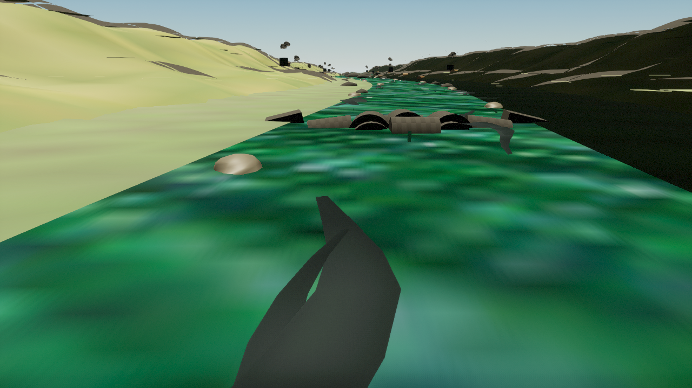
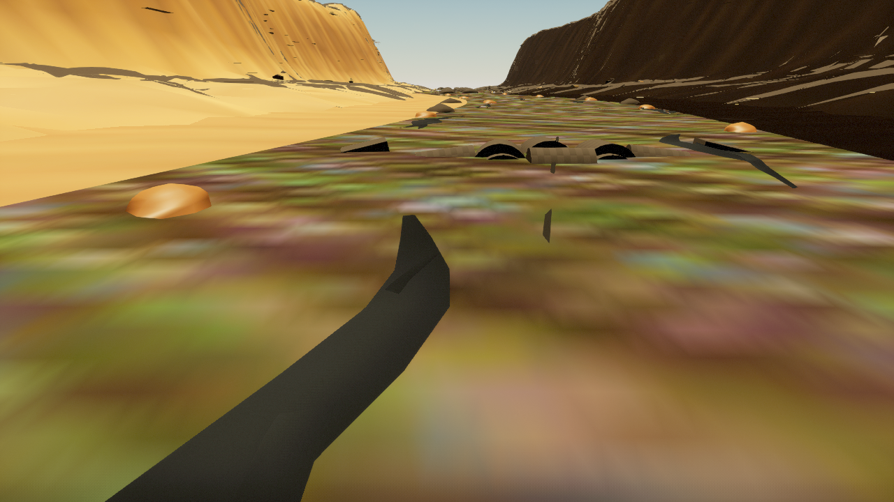
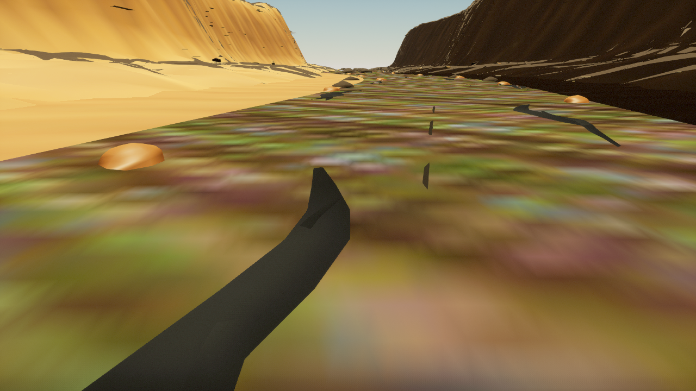
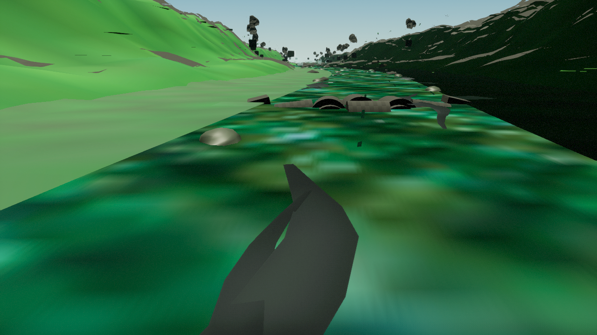
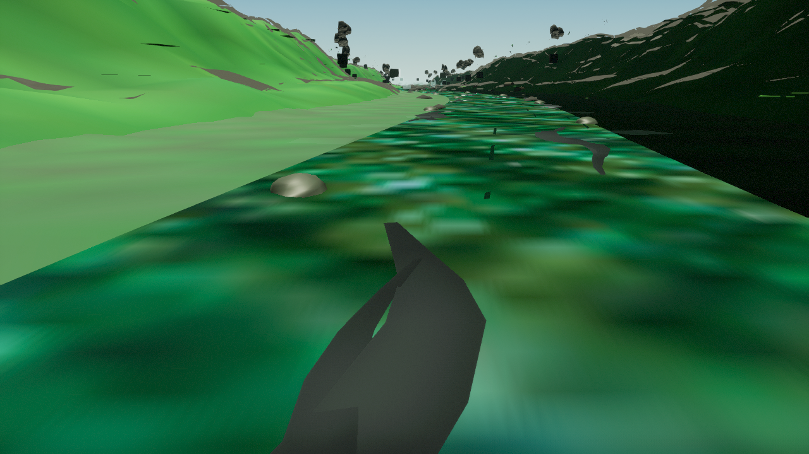

# Photoreal Human Lifelike Review Packet

Generated on: `2026-07-08`

Status: `awaiting_human_lifelike_review_not_approved`

This packet is for human review of the current zero-blocker Unreal capture candidates. The images are not approved as lifelike or production-ready until every review domain below has accepted evidence.

Source artifacts:

- Capture manifest: `docs/environment-captures/photoreal_river_previews/environment_capture_manifest.json`
- Automated capture review: `docs/environment-captures/photoreal_river_previews/photoreal_capture_quality_review.json`
- Desktop/VR performance evidence: `docs/environment-captures/photoreal_river_previews/photoreal_environment_performance_review.json`
- Human review handoff JSON: `docs/environment-captures/photoreal_river_previews/photoreal_human_lifelike_review_handoff.json`
- Human review results template: `docs/environment-captures/photoreal_river_previews/photoreal_human_lifelike_review_results_template.json`
- Reference media queue: `physics/data/real_world/reference_media_review_queue.json`
- Gap register: `physics/data/real_world/production_environment_gap_register.json`

## Required Review Domains

- [ ] **Art Direction Visual Lifelike**
  Reviewer: `environment_art_or_art_direction`
  Required evidence:
  - `side_by_side_review_against_rights_reviewed_reference_links_or_first_party_field_media`
  - `river_specific_notes_for_terrain_water_rocks_foliage_foam_mist_lighting_and_raft_foreground`
- [ ] **Guide Hydraulic Fidelity**
  Reviewer: `river_guide_or_oarsman_domain_reviewer`
  Required evidence:
  - `flow_band_specific_notes_for_line_choice_holes_laterals_boils_eddy_lines_wave_trains_and_wet_banks`
  - `raft_outcome_sanity_notes_for_surf_flush_pin_release_flip_and_swimmer_visibility`
- [ ] **Geospatial Source Alignment**
  Reviewer: `geospatial_or_technical_art_reviewer`
  Required evidence:
  - `capture_overlays_or_notes_checking_river_centerline_banks_heightfield_masks_and_source_drape_alignment`
  - `known_preview_derivative_limitations_and_required_production_import_replacements`
- [ ] **Rights And Reference Media**
  Reviewer: `rights_or_content_provenance_reviewer`
  Required evidence:
  - `item_level_license_permission_attribution_and_allowed_use_for_any_photo_footage_or_social_reference`
  - `confirmation_that_uncleared_media_remains_link_only_and_not_used_as_texture_training_or_packaged_asset_input`
- [ ] **Hazard And Rescue Readability**
  Reviewer: `gameplay_safety_or_rescue_readability_reviewer`
  Required evidence:
  - `notes_that_water_foam_mist_foliage_and_lighting_do_not_hide_hazards_swimmers_throw_rope_zones_or_rescue_targets`
  - `notes_that_visual_forcing_or_art_layers_do_not_hide_solver_or_conservation_failures`
- [ ] **Production Material Asset Promotion**
  Reviewer: `technical_art_or_rendering_reviewer`
  Required evidence:
  - `promotion_decision_for_review_only_texture2d_material_instance_and_procedural_proxy_surfaces`
  - `replacement_or_approval_plan_for_landscape_water_rocks_foliage_foam_mist_lighting_and_raft_foreground_assets`
- [ ] **Desktop And Vr Performance**
  Reviewer: `performance_or_vr_reviewer`
  Required evidence:
  - `desktop_capture_settings_frame_time_gpu_memory_and_scalability_notes`
  - `vr_or_low_power_capture_settings_comfort_frame_time_and_visual_readability_notes`

## River Review Sheets

### South Fork American River (`american_south_fork`)

Review status: `awaiting_human_lifelike_review_not_approved`

Map package: `/Game/RaftSim/Maps/EnvironmentPreviews/L_SouthForkAmerican_PhotorealPreview`

Source manifest: `physics/data/real_world/south_fork_american_chili_bar/source_manifest.json`

Flow context:

- `flow_band_id`: `median_runnable`
- `flow_band_display_name`: `Median Runnable / Summer Commercial`
- `flow_band_source`: `physics/data/real_world/south_fork_american_chili_bar/flow_presets.json`
- `flow_reference_discharge_cfs`: `1600.0`
- `flow_visual_width_scale`: `1.0`
- `flow_visual_foam_scale`: `1.0`
- `flow_visual_wet_bank_scale`: `1.0`
- `flow_visual_current_cue_scale`: `1.0`
- `flow_visual_water_level_offset_cm`: `0.0`
- `flow_visual_note`: Default South Fork summer-commercial validation band from USGS-11445500 planning presets; keeps moderate tongues, wet rocks, and foam lines visible while low/high seasonal variants remain future capture targets.

Source inputs for review:

- `aerial_drape_image`: `physics/data/real_world/south_fork_american_chili_bar/imagery/production_import_pilot/source_drape_4096.png`
- `terrain_relief_image`: `physics/data/real_world/south_fork_american_chili_bar/terrain/production_import_pilot/dem_relief_2048.png`
- `heightfield_preview_image`: `physics/data/real_world/south_fork_american_chili_bar/terrain/production_import_pilot/heightfield_candidate_2017.png`
- `water_mask_image`: `physics/data/real_world/south_fork_american_chili_bar/imagery/production_import_pilot/water_mask_2048.png`
- `vegetation_mask_image`: `physics/data/real_world/south_fork_american_chili_bar/imagery/production_import_pilot/vegetation_mask_2048.png`
- `source_conditioned_macro_albedo_image`: `unreal/Content/RaftSim/Rendering/SourceConditionedMaterialMaps/american_south_fork_source_conditioned_macro_albedo.png`
- `source_conditioned_material_zones_image`: `unreal/Content/RaftSim/Rendering/SourceConditionedMaterialMaps/american_south_fork_source_conditioned_material_zones.png`
- `source_conditioned_ao_roughness_height_image`: `unreal/Content/RaftSim/Rendering/SourceConditionedMaterialMaps/american_south_fork_source_conditioned_ao_roughness_height.png`
- `source_conditioned_normal_detail_image`: `unreal/Content/RaftSim/Rendering/SourceConditionedMaterialMaps/american_south_fork_source_conditioned_normal_detail.png`
- `elevation_sample`: `physics/data/real_world/south_fork_american_chili_bar/terrain/production_import_pilot/3dep_tiles`

Captures:

| View | Image | Entropy | Edge | Low-gradient | Luma std | Human status |
| --- | --- | ---: | ---: | ---: | ---: | --- |
| `guide_seat_downstream` |  | 4.48 | 0.0947 | 0.6983 | 53.87 | `not_reviewed` |
| `river_eye_downstream` |  | 4.45 | 0.0937 | 0.7 | 53.51 | `not_reviewed` |

Reviewer checks:

- [ ] `art_direction_visual_lifelike` - `environment_art_or_art_direction`
- [ ] `guide_hydraulic_fidelity` - `river_guide_or_oarsman_domain_reviewer`
- [ ] `geospatial_source_alignment` - `geospatial_or_technical_art_reviewer`
- [ ] `rights_and_reference_media` - `rights_or_content_provenance_reviewer`
- [ ] `hazard_and_rescue_readability` - `gameplay_safety_or_rescue_readability_reviewer`
- [ ] `production_material_asset_promotion` - `technical_art_or_rendering_reviewer`
- [ ] `desktop_and_vr_performance` - `performance_or_vr_reviewer`

Reference media review prompts:

- `south_fork_guide_seat_boulder_garden`: Chili Bar to Coloma guide-seat downstream frame
  - Are exposed rocks, bank trees, and water color believable at summer commercial flow?
  - Can a swimmer and throw-rope recovery zone remain visible behind foam and boulders?
  - Rights status: `candidate_links_only`
- `south_fork_late_summer_exposed_rocks`: Low-flow rock exposure and wet-bank comparison
  - Which boulder faces should be dry, damp, or freshly splashed?
  - How much yellow grass and oak scrub should appear on late-season banks?
  - Rights status: `candidate_links_only`
- `south_fork_high_flow_foam_lines`: Spring runoff or release-driven high-flow review
  - Where should foam streaks and eddy fences strengthen without hiding hazards?
  - How high should wet banks and splash marks climb at high runnable flow?
  - Rights status: `candidate_links_only`

Reviewer notes:

- Art direction visual lifelike:
- Guide/hydraulic fidelity:
- Geospatial source alignment:
- Rights/media provenance:
- Hazard and rescue readability:
- Production material/asset promotion:
- Desktop and VR performance:

Decision:

- [ ] Keep as preview-only candidate evidence
- [ ] Request regeneration with listed fixes
- [ ] Approve this river for lifelike promotion after all gates above are signed off

### Colorado River Grand Canyon (`colorado_river`)

Review status: `awaiting_human_lifelike_review_not_approved`

Map package: `/Game/RaftSim/Maps/EnvironmentPreviews/L_ColoradoGrandCanyon_PhotorealPreview`

Source manifest: `physics/data/real_world/colorado_river_grand_canyon_rowing/source_manifest.json`

Flow context:

- `flow_band_id`: `moderate_release_planning`
- `flow_band_display_name`: `Moderate Release Planning`
- `flow_band_source`: `physics/data/real_world/colorado_river_grand_canyon_rowing/flow_presets.json`
- `flow_reference_discharge_cfs`: `12000.0`
- `flow_visual_width_scale`: `1.08`
- `flow_visual_foam_scale`: `1.15`
- `flow_visual_wet_bank_scale`: `1.1`
- `flow_visual_current_cue_scale`: `1.15`
- `flow_visual_water_level_offset_cm`: `8.0`
- `flow_visual_note`: Default Grand Canyon rowing preview band from release-planning presets; slightly widens the big-water ribbon and strengthens long wave/current cues while release history and guide review remain required.

Source inputs for review:

- `aerial_drape_image`: `physics/data/real_world/colorado_river_grand_canyon_rowing/imagery/production_import_pilot/source_drape_4096.png`
- `terrain_relief_image`: `physics/data/real_world/colorado_river_grand_canyon_rowing/terrain/production_import_pilot/dem_relief_2048.png`
- `heightfield_preview_image`: `physics/data/real_world/colorado_river_grand_canyon_rowing/terrain/production_import_pilot/heightfield_candidate_2017.png`
- `water_mask_image`: `physics/data/real_world/colorado_river_grand_canyon_rowing/imagery/production_import_pilot/water_mask_2048.png`
- `vegetation_mask_image`: `physics/data/real_world/colorado_river_grand_canyon_rowing/imagery/production_import_pilot/vegetation_mask_2048.png`
- `source_conditioned_macro_albedo_image`: `unreal/Content/RaftSim/Rendering/SourceConditionedMaterialMaps/colorado_river_source_conditioned_macro_albedo.png`
- `source_conditioned_material_zones_image`: `unreal/Content/RaftSim/Rendering/SourceConditionedMaterialMaps/colorado_river_source_conditioned_material_zones.png`
- `source_conditioned_ao_roughness_height_image`: `unreal/Content/RaftSim/Rendering/SourceConditionedMaterialMaps/colorado_river_source_conditioned_ao_roughness_height.png`
- `source_conditioned_normal_detail_image`: `unreal/Content/RaftSim/Rendering/SourceConditionedMaterialMaps/colorado_river_source_conditioned_normal_detail.png`
- `elevation_sample`: `physics/data/real_world/colorado_river_grand_canyon_rowing/terrain/production_import_pilot/3dep_tiles`

Captures:

| View | Image | Entropy | Edge | Low-gradient | Luma std | Human status |
| --- | --- | ---: | ---: | ---: | ---: | --- |
| `guide_seat_downstream` |  | 4.43 | 0.1106 | 0.6081 | 46.8 | `not_reviewed` |
| `river_eye_downstream` |  | 4.42 | 0.1101 | 0.6084 | 46.45 | `not_reviewed` |

Reviewer checks:

- [ ] `art_direction_visual_lifelike` - `environment_art_or_art_direction`
- [ ] `guide_hydraulic_fidelity` - `river_guide_or_oarsman_domain_reviewer`
- [ ] `geospatial_source_alignment` - `geospatial_or_technical_art_reviewer`
- [ ] `rights_and_reference_media` - `rights_or_content_provenance_reviewer`
- [ ] `hazard_and_rescue_readability` - `gameplay_safety_or_rescue_readability_reviewer`
- [ ] `production_material_asset_promotion` - `technical_art_or_rendering_reviewer`
- [ ] `desktop_and_vr_performance` - `performance_or_vr_reviewer`

Reference media review prompts:

- `colorado_river_eye_canyon_scale`: Lees Ferry / Grand Canyon river-eye downstream frame
  - Do canyon walls read at Grand Canyon scale from low raft height?
  - Are sandbars, talus, and sparse riparian shrubs distributed believably?
  - Rights status: `candidate_links_only`
- `colorado_release_wet_banks_and_sandbars`: Release-aware sandbar and wet-bank review
  - Which sandbars should be exposed or damp across low, moderate, and high release bands?
  - Do current seams, boils, and lateral waves stay readable for an oarsman?
  - Rights status: `candidate_links_only`
- `colorado_long_swimmer_rescue_visibility`: Long-water rescue and oar-rig sightline review
  - Can the player read swimmer position at Grand Canyon scale?
  - Do boils, wave trains, canyon shadows, and oar frame foreground avoid hiding rescue targets?
  - Rights status: `candidate_links_only`

Reviewer notes:

- Art direction visual lifelike:
- Guide/hydraulic fidelity:
- Geospatial source alignment:
- Rights/media provenance:
- Hazard and rescue readability:
- Production material/asset promotion:
- Desktop and VR performance:

Decision:

- [ ] Keep as preview-only candidate evidence
- [ ] Request regeneration with listed fixes
- [ ] Approve this river for lifelike promotion after all gates above are signed off

### Pacuare River Rainforest (`pacuare`)

Review status: `awaiting_human_lifelike_review_not_approved`

Map package: `/Game/RaftSim/Maps/EnvironmentPreviews/L_PacuareRainforest_PhotorealPreview`

Source manifest: `physics/data/real_world/pacuare_river_costa_rica/source_manifest.json`

Flow context:

- `flow_band_id`: `rainfed_runnable_planning`
- `flow_band_display_name`: `Rain-Fed Runnable Planning`
- `flow_band_source`: `physics/data/real_world/pacuare_river_costa_rica/flow_presets.json`
- `flow_visual_width_scale`: `1.05`
- `flow_visual_foam_scale`: `1.2`
- `flow_visual_wet_bank_scale`: `1.2`
- `flow_visual_current_cue_scale`: `1.18`
- `flow_visual_water_level_offset_cm`: `7.0`
- `flow_visual_note`: Default Pacuare planning band uses relative rainfed-runnable context only; numeric discharge stays unset until Costa Rica gauge, rainfall, flash-response, and guide review clear it.

Source inputs for review:

- `aerial_drape_image`: `physics/data/real_world/pacuare_river_costa_rica/imagery/production_import_pilot/sentinel_augmented_source_drape_preview_4096.png`
- `terrain_relief_image`: `physics/data/real_world/pacuare_river_costa_rica/terrain/production_import_pilot/dem_relief_2048.png`
- `heightfield_preview_image`: `physics/data/real_world/pacuare_river_costa_rica/terrain/production_import_pilot/heightfield_candidate_2017.png`
- `water_mask_image`: `physics/data/real_world/pacuare_river_costa_rica/imagery/production_import_pilot/water_mask_2048.png`
- `vegetation_mask_image`: `physics/data/real_world/pacuare_river_costa_rica/imagery/production_import_pilot/vegetation_mask_2048.png`
- `source_conditioned_macro_albedo_image`: `unreal/Content/RaftSim/Rendering/SourceConditionedMaterialMaps/pacuare_source_conditioned_macro_albedo.png`
- `source_conditioned_material_zones_image`: `unreal/Content/RaftSim/Rendering/SourceConditionedMaterialMaps/pacuare_source_conditioned_material_zones.png`
- `source_conditioned_ao_roughness_height_image`: `unreal/Content/RaftSim/Rendering/SourceConditionedMaterialMaps/pacuare_source_conditioned_ao_roughness_height.png`
- `source_conditioned_normal_detail_image`: `unreal/Content/RaftSim/Rendering/SourceConditionedMaterialMaps/pacuare_source_conditioned_normal_detail.png`
- `elevation_sample`: `physics/data/real_world/pacuare_river_costa_rica/terrain/copernicus_dem_glo30_N09_W084.tif; physics/data/real_world/pacuare_river_costa_rica/terrain/copernicus_dem_glo30_N10_W084.tif`

Captures:

| View | Image | Entropy | Edge | Low-gradient | Luma std | Human status |
| --- | --- | ---: | ---: | ---: | ---: | --- |
| `guide_seat_downstream` |  | 4.47 | 0.0829 | 0.6949 | 44.78 | `not_reviewed` |
| `river_eye_downstream` |  | 4.45 | 0.0826 | 0.6954 | 44.64 | `not_reviewed` |

Reviewer checks:

- [ ] `art_direction_visual_lifelike` - `environment_art_or_art_direction`
- [ ] `guide_hydraulic_fidelity` - `river_guide_or_oarsman_domain_reviewer`
- [ ] `geospatial_source_alignment` - `geospatial_or_technical_art_reviewer`
- [ ] `rights_and_reference_media` - `rights_or_content_provenance_reviewer`
- [ ] `hazard_and_rescue_readability` - `gameplay_safety_or_rescue_readability_reviewer`
- [ ] `production_material_asset_promotion` - `technical_art_or_rendering_reviewer`
- [ ] `desktop_and_vr_performance` - `performance_or_vr_reviewer`

Reference media review prompts:

- `pacuare_rainforest_gorge_density`: Lower Pacuare rainforest gorge guide-seat frame
  - How dense should canopy, vines, wet rock, and shadow be before rescue targets become unreadable?
  - What water color and humidity/mist cues distinguish clear-season from rain-fed conditions?
  - Rights status: `candidate_links_only`
- `pacuare_waterfalls_mist_wet_rock`: Waterfall, mist, and wet-rock detail pass
  - Where should mist and side waterfalls add atmosphere without masking line choice?
  - Which wet-rock classes need procedural material variants before first-party field capture exists?
  - Rights status: `candidate_links_only`
- `pacuare_canopy_rescue_readability`: Dense foliage swimmer/rescue visibility review
  - Can a swimmer be tracked under tree-shadow and mist?
  - Which foreground leaves and branches must be culled or faded near rescue targets?
  - Rights status: `candidate_links_only`

Reviewer notes:

- Art direction visual lifelike:
- Guide/hydraulic fidelity:
- Geospatial source alignment:
- Rights/media provenance:
- Hazard and rescue readability:
- Production material/asset promotion:
- Desktop and VR performance:

Decision:

- [ ] Keep as preview-only candidate evidence
- [ ] Request regeneration with listed fixes
- [ ] Approve this river for lifelike promotion after all gates above are signed off

## Final Promotion Rule

Do not mark any river lifelike or production-playable from this packet unless every review domain has accepted evidence, rights are recorded for any visual references, hazards and rescue targets remain readable, and desktop plus VR performance evidence is attached.
