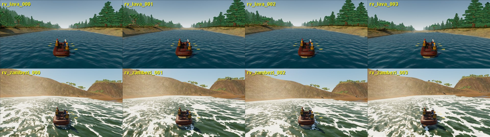
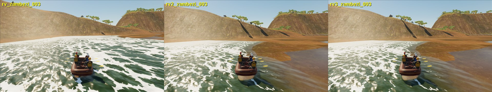

# Chilko and Zambezi water review (September 26)

All-scene water review of the two shipping reference runs outside the ordered
four-river reconstruction: rendered view, raft-launch behaviour, the P4 map
checks and frame time in the editor-hosted game (1280 x 720, 1,200 frames,
rows 30-1169; [frame audits](chilko-zambezi-water-review-20260926/frame-audits.json)).
No cooked field, bed, terrain or collision data changed. This is not photoreal
or real-world hydraulic acceptance for either river.

## Chilko Lava Canyon

- **Frame time passes:** mean 18.6 ms, p95 36.5 ms, max 56.6 ms, no frame over
  100 ms.
- **P4 now passes.** The strongest launch-window jump sits in the interpreted
  crux (station 304 m) 4 m from the wet edge, coverage 0.966. The test still
  demanded the legacy overlay margin (full coverage, 15 m). Single-surface
  rivers deliberately accept jumps inside the bank feather (coverage >= 0.55,
  clearance >= max(lattice, 3 m); the rule that keeps the measured Troublemaker
  hole), so the test now applies the carrier's own rule and prints the values.
- **Still open:** the launch view shows dark banded water without whitewater;
  the four review-gated D4 rocks still contact the raft as full-height
  cylinders although their crests sit about 1 m under water, so the raft can
  snag on nothing visible (changing the contact rule needs the Python
  reference model and parity fixtures to change with it).

## Zambezi

**Before: about 5 FPS** (mean 202 ms, p95 235 ms, every frame over 100 ms). Two
causes, both in the runtime configuration rather than the data:

- The fixed live window covered the whole 30 km procedural corridor (5,999 x 25
  cells at 5 x 10 m, ~20 ms per solver step) and the bridge steps water at
  1/60 s, so the fixed-step clock could never catch up (85 s backlog).
- The carrier used the 0.5 m lattice (92,833 vertices, 106 ms refresh), 10 x 20
  vertices per solver cell.

Changes:

- Zambezi now uses moving-window streaming over the unchanged cooked field:
  640 x 250 m, re-centred every 80 m
  (`physics/data/real_world/zambezi_batoka_gorge/scenario_zambezi_run/runtime/moving_water_streaming.json`;
  saved map via `unreal/Scripts/set_zambezi_moving_window.py`; the map
  generator writes the same values).
- Internal cut edges of curved moving windows are now held to the cooked state
  with two ghost layers (as Cartesian crops already were) instead of a
  zero-gradient copy that lets a backwater-held reach drain out of the cut.
  Fixed crux windows and full-grid edges are unchanged; the four river-window
  regression tests pass.
- The carrier returns to Zambezi's documented 1.5 m lattice (10,465 vertices),
  still many vertices per 5 x 10 m solver cell. At 1 m the 15 Hz big-water
  refresh (~35 ms) left p95 at 54.3 ms.

| Zambezi launch | mean ms | p95 ms | max ms | frames > 100 ms |
| --- | ---: | ---: | ---: | ---: |
| before (fixed 30 km window, 0.5 m) | 202.0 | 235.2 | 306.7 | 1140 |
| moving window, 1 m | 21.7 | 54.3 | 82.6 | 0 |
| moving window, 1.5 m (two runs) | 13.2 / 11.1 | 27.0 / 23.9 | 34.3 / 26.9 | 0 |

In the before run the solver ran in slow motion, so after the same wall time
the raft had hardly moved; in real time it drifts to the right-bank flat
visible in the other two frames. The water level there is not draining (ghost
boundaries made no visible difference).

**Consequence, left failing:** P4 expects six rapid roller, aerosol and spray
emitters at the start apron and now gets zero. Twelve breaking sites exist (the
nearest 52 m from the camera), but once the solver actually runs in real time
the procedural field relaxes and the strongest site intensity is 0.146 against
the emitters' 0.12 threshold with most below it. The old count depended on a
solver that never kept real time. The threshold and the expectation were not
changed; Zambezi's procedural, not surveyed, hydraulics are the real limit.
