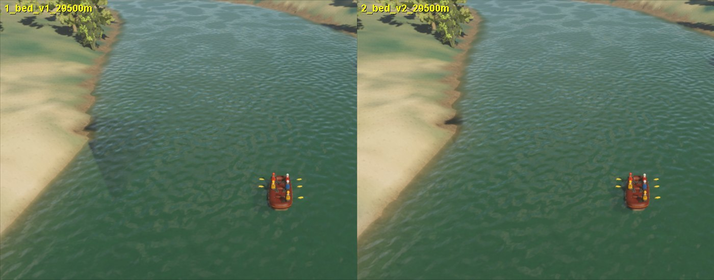
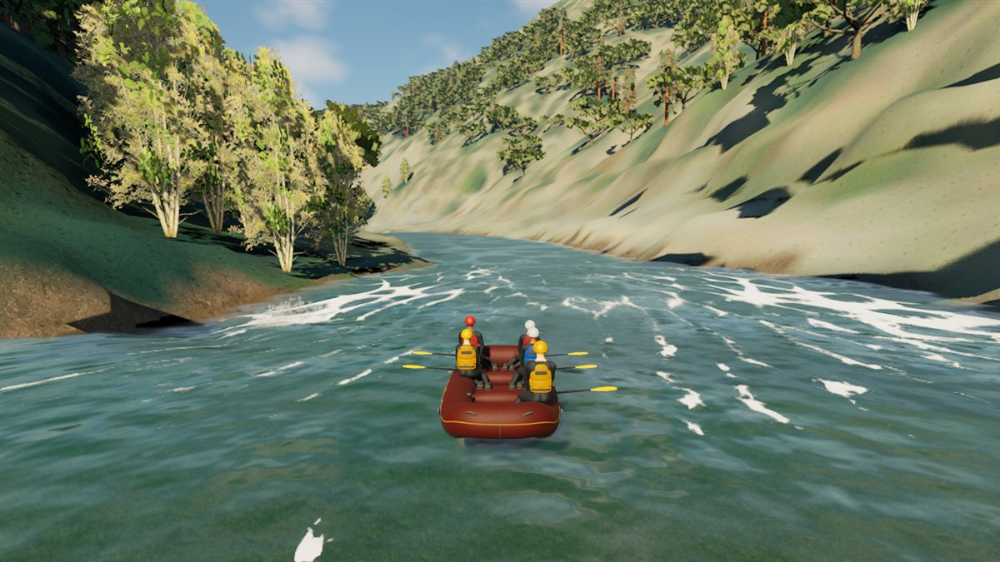

# South Fork riverbed v2: no inferred ledges

September 26, 2026. **Playable delivery in the normal FullReach map.** The
discharge-consistent bed (v1, same day) applied one constant depth per 5 m
route bin and an unsmoothed pool weight and calibration bias. Wherever the
captured slope crossed the pool band (0.002-0.006), neighbouring bins jumped by
up to 1.07 m, so the inferred bed had straight cross-channel ledges. They
showed in play as straight-edged dark wedges on the water (the "dark notch" at
29.5 km) and are not plausible river geometry. Bed v2 removes them without
changing any measured input. The bed under water is still inferred, not
measured.

## Change

`physics/scripts/build_south_fork_discharge_bed.py --along-route-sigma-bins 2`
(the default 0 reproduces v1 bit-exactly, verified):

- pool weight and the settled-cook bias are Gaussian-smoothed along the route
  (sigma 10 m), like slope and normal depth already were;
- bank-shape length and depth are interpolated continuously in station instead
  of held constant per bin.

Captured surface, water outline, dry terrain, discharge, roughness, the
calibration bias itself and the protected Troublemaker rectangle are unchanged.

| along-route ledges | v1 | v2 |
| --- | ---: | ---: |
| largest step between 5 m bins | 1.07 m | 0.38 m |
| bin steps over 0.5 m | 41 | 0 |
| channel-interior neighbour cells differing > 0.2 m | 7,657 | 426 |
| channel-interior neighbour cells differing > 0.4 m | 2,294 | 178 |

## Cook

Instead of a fresh 1.8 h cook from the captured surface, the v2 cook continues
the v1 600 s state: the seeded free surface and velocity are kept and depth is
re-derived over the new bed (`prepare_south_fork_discharge_bed_cook.py
--seed-frame`, layout verified against the seed's own frame 0; seeded volume
within 0.2% of v1). It then ran 300 s more (929 s since the captured start,
49 min on 12 lanes).

| cook | wet fraction | median abs error | 10th/90th pct error | bins > 0.25 m | Fr > 1 share | outflow |
| --- | ---: | ---: | ---: | ---: | ---: | ---: |
| v1, 600 s | 0.964 | 0.094 m | -0.21 / +0.18 m | 925 | 0.28% | 40.2 m3/s |
| v2, +300 s | 0.964 | 0.097 m | -0.20 / +0.20 m | 969 | 0.26% | 39.8 m3/s |

Accuracy against the captured surface is unchanged within noise; all
artificial tile-union banks stay exactly dry. Inflow is 45.3 m3/s, so the reach
is still slowly filling: not settled hydraulics.

## Integration

- 188 coarse and 2 context terrain tiles re-imported in place (collision
  within 0.0015 cm of the source vertices; map not modified).
- Runtime export: 841-tile atlas and 799 packets, exact bed intersection gate
  (42,185,039 cells), live-window bounds unchanged.
- Water config rebound (only its actor package saved) and a new verified bundle
  `physics/data/runtime_bundles/south_fork_discharge_bed_v4` (2,405 files)
  staged by `RaftSimWater.Build.cs`; v3 is retained.

Archived: `physics/data/real_world/south_fork_american_chili_bar/reconstruction_2026_09/full_reach/discharge_bed_v2_20260926/`
(bed, cook input manifest, analysis, bank audit, render tiles), FBX exports in
`unreal/SourceArt/RaftSim/SouthForkDischargeBedV2_20260926/`.

## Performance (not accepted)

Editor-hosted game, 1,200 frames, rows 30-1169. Every run overlapped other
host work: 50-60% processor load before start, from the desktop app's git
diff jobs over the new bundle and the other session's cook, so these are not
idle-host results.

| launch | mean ms | p95 ms | max ms | > 100 ms |
| --- | ---: | ---: | ---: | ---: |
| normal Boot/menu (two runs) | 35.4 / 36.6 | 43.5 / 43.9 | 52.7 / 54.2 | 0 / 0 |
| station 1,320 m (Meat Grinder) | 28.6 | 41.0 | 75.1 | 0 |
| station 27,600 m (gorge chute) | 40.9 | 51.3 | 85.5 | 0 |
| station 11,520 m | 51.0 | 82.0 | 150.5 | 3 |

The 11.5 km run is well over budget. Its slow frames scale every water stage
by about the same factor against an earlier 11.5 km run (crest update 10.9 vs
6.4 ms, crest selection 6.2 vs 3.1 ms, solver step 10.2 vs 6.4 ms), which points
at processor contention rather than one new cost; the far-field ring is not
among the top costs. A repeat on an idle host is required before any
conclusion. Busy-rapid performance remains open.
