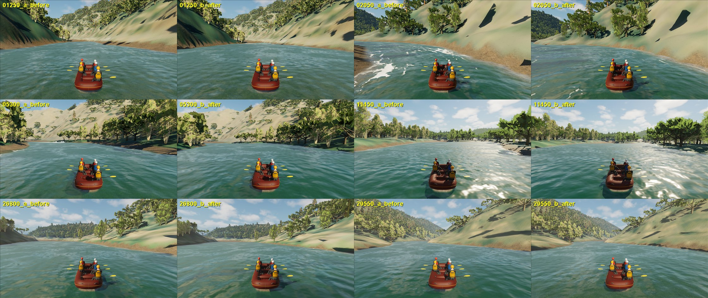
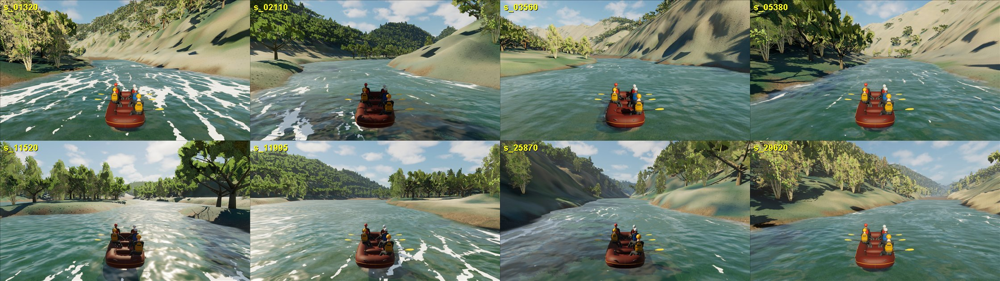
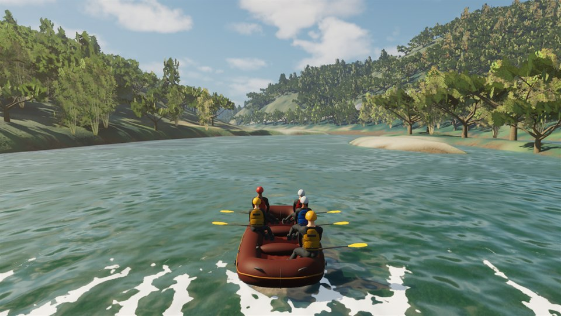

# South Fork discharge-consistent riverbed

September 26, 2026. **Playable delivery in the normal FullReach map:** new
inferred riverbed, re-cooked river, rebuilt riverbed terrain and a new runtime
bundle. Evidence used: the captured (hydro-flattened) 3DEP water
surface and water outline already in the repository, the authored 1,600 cfs
(45.3 m3/s) discharge and the solver's Manning roughness (0.035). The bed below
the water surface remains inferred; nothing here is measured bathymetry.

## What the player saw

A capture pass at the rapids that the NAIP imagery and the captured water
surface both identify (Meat Grinder 1.25 km, 2.05 km, 5.3 km, 11.45 km, the gorge
at 26.8 and 29.55 km) showed smooth water everywhere except Troublemaker, with
exposed brown trough banks where the river had sunk below its outline (see the
before/after sheet under "In the game").

## Cause

The submerged bed of every inferred water vertex was the captured surface
lowered by `min(2.2 m, 0.35 x shore distance)`. Riffles and rapids were
therefore as deep as pools, and the bed had no hydraulic controls:

- The captured surface has real pool-riffle structure: Meat Grinder drops 4 m in
  150 m (slope 0.027), the 2 km rapid 3 m in 150 m, Troublemaker 2.1 m in 60 m;
  pools are nearly flat (0.001-0.004).
- On the uniform trough the river drains below its captured outline. The full
  cook still discharged about twice its inflow after 17,700 s; the 4,950 s frame
  the game uses has a median absolute surface error of 0.46 m (10th/90th
  percentile -1.06/+0.69 m) and subcritical flow through most rapids.
- A local Meat Grinder test (17 tiles, water started at the captured surface)
  settled 1.11 m below the captured surface on the previous bed.

## Method

`physics/scripts/build_south_fork_discharge_bed.py` (numpy only) rebuilds the
submerged vertices of the 2 m context grid; dry vertices, the captured surface
and the water outline are bit-identical.

| Quantity | Source | Status |
| --- | --- | --- |
| Water surface, slope, outline | captured 3DEP DEM (hydro-flattened) + breaklines | measured |
| Discharge 45.3 m3/s | authored 1,600 cfs scenario | authored; flight-time flow unknown |
| Roughness n = 0.035 | existing solver configuration | authored |
| Cross-section shape f = min(1, d / L), L = max(3 m, 0.3 x half-width) | assumption | inferred |
| Riffle depth: Manning strip normal depth per 5 m station bin | Q, n, captured slope, shape | inferred |
| Pool depth 2.2 m where captured slope < 0.006 (full at < 0.002) | previous prior | inferred |
| Mapped-water cells > 0.3 m above the local stage are bank | captured surface | inferred classification |
| Calibration: settled-cook surface bias | section cooks | fitted |

Pools are stage-controlled by the next riffle, so their depth does not set the
water surface; the riffle depths do. Six overlapping 6 km section cooks
(600 s each) showed that where a reach already passes the full discharge the
solver needs about 30% more riffle depth than the strip estimate (median error
+0.19 m on 690 settled riffle bins; settled pools +0.01 m). The calibrated bed
adds the measured settled bias where available and 0.30 x the riffle depth
elsewhere. The registered Troublemaker domain (owners 2, 3, 5, 6) is untouched;
depth blends to the previous prior within 30 m of its rectangle.

Resampling the 2 m grid with the render/collision triangle rule reproduces all
761,600 checked 1 m hydraulic bed cells of the previous geometry bit for bit,
so the cook, the runtime packets and the terrain meshes carry one surface.

## Full-river cook

One continuous full-river cook (841 tiles, 5.38 million 1 m cells, 12 worker
lanes) started with water at the captured surface. It stayed near balance from
the start: storage grew by 6,890 m3 (0.3% of 2.29 million m3) in 600 s, and the
outflow at the reservoir end recovered from 24 to 40 m3/s against the 45.3 m3/s
inflow; only the flat reservoir arm past the take-out was still filling. The
cook was stopped at 629 s. The 600 s frame passes the snapshot audit and keeps
all 86,720 artificial bank cells exactly dry; it is the exported state.

| Surface minus captured surface | Current game (4,950 s) | Discharge bed (600 s) |
| --- | ---: | ---: |
| median | +0.01 m | +0.03 m |
| median absolute | 0.46 m | 0.09 m |
| 10th / 90th percentile | -1.06 / +0.69 m | -0.21 / +0.18 m |
| 5 m bins off by more than 0.25 m | 5,058 of 6,782 | 925 of 6,782 |
| captured water outline wetted | 94.7% | 96.4% |

Rapids now carry the captured drops; pools are slow. Per reach (median surface
error; largest share of cells above Froude 1 in any 5 m bin; fastest cell):

| Reach | Error old / new | Supercritical old / new | Max speed old / new |
| --- | ---: | ---: | ---: |
| Meat Grinder (1.15-1.37 km) | -1.53 / +0.04 m | 0.19 / 0.30 | 2.6 / 3.2 m/s |
| 3.5 km | -1.36 / 0.00 m | 0.00 / 0.13 | 1.9 / 2.6 m/s |
| 11.5 km | -0.34 / +0.31 m | 0.00 / 0.57 | 2.2 / 4.5 m/s |
| 12.0 km | -0.19 / +0.27 m | 0.00 / 0.27 | 2.4 / 3.6 m/s |
| Gorge 27.6 km | -0.34 / +0.32 m | 0.00 / 0.56 | 1.9 / 3.9 m/s |
| Gorge 25.8 km | +0.16 / +0.06 m | 0.81 / 0.13 | 5.1 / 3.0 m/s |
| Pool 1.4 km | -0.38 / +0.03 m | 0.45 / 0.00 | 3.7 / 2.2 m/s |
| Troublemaker (protected) | -0.81 / -0.77 m | 0.51 / 0.56 | 6.3 / 4.6 m/s |

The old supercritical "pool" at 1.4 km and the old fast gorge reach at 25.8 km
were artefacts of the draining state. Where the new surface stands 0.3 m high
(11.5, 12.0, 27.6 km) the median includes the rise behind hydraulic jumps.
All numbers: [cook receipt](south-fork-discharge-bed/cook-receipt.json).

## In the game

Same normal-game chase camera and stations, old (left of each pair) and new
(right) water: the river now fills its banks and no trough strip is exposed.

At the steepest point of each evidence rapid the new water foams: Meat Grinder
(1.32 km) is streaked across the channel, 2.11 and 12.0 km show breaking
patches; 3.56, 5.38, 25.87 and 29.62 km are fast and textured but not white.

## Integration

- **Terrain.** 188 coarse and 2 context terrain tiles whose submerged vertices
  changed were rebuilt from the new grid (XY, triangles and indices unchanged)
  and re-imported in place; 1,520 collision probes hit within 0.0015 cm
  (gate 0.1 cm). The other session's independent audits of all 441 tiles and
  of the runtime bundle passed.
- **Runtime.** `physics/scripts/export_south_fork_discharge_bed_runtime.py`
  exported the 600 s state; each of the 42,185,039 packet cells that overlap a
  cooked tile equals the atlas bed exactly. The map's river water config now
  points at `tmp/discharge-bed-runtime-v1-20260926` (coordinate maps and run
  manager unchanged), and `physics/data/runtime_bundles/south_fork_discharge_bed_v3`
  (2,405 files) is the bundle `RaftSimWater.Build.cs` stages; v2 is retained.
- **Streaming hitch removed.** Profiles showed one reproducible 427-444 ms frame
  (three runs) when the Troublemaker cell streamed in about 2 km before the
  rapid: the 803,842-triangle captured ground, rock flanks, join and the
  1,268-tree bank canopy. Shadows and distance fields were ruled out. These four
  actors now load with the map (`unreal/Scripts/set_troublemaker_always_loaded.py`);
  afterwards no profiled frame exceeded 100 ms.
- Details: [integration receipt](south-fork-discharge-bed/integration-receipt.json).

## Tests and performance

`RaftSim.P4` with rendering: 8 of 9 pass (1 of 9 on the committed baseline).
Test maintenance, each tied to a documented design: reference maps at the 1 m
presentation lattice (commit 25aefa24d), Hance support without the retired
standing-wave train, South Fork without the 113 legacy boulder contacts retired
by the September 12 assembly, the Cartesian 225 x 225 carrier, and approach
telemetry that resolves route stations through the scenario route map instead
of Cartesian coordinates. Still failing: Lava Canyon's strongest launch-window
jump now sits 4 m from the wet edge (15 m required); left for the Chilko review.

Editor-hosted game, 1280 x 720, 1,200 frames, rows 30-1169
([frame audits](south-fork-discharge-bed/frame-audits.json)):

| Launch | mean ms | p95 ms | max ms | frames > 100 ms |
| --- | ---: | ---: | ---: | ---: |
| normal Boot/menu | 25.7 | 34.1 | 39.5 | 0 |
| normal Boot/menu, Troublemaker loaded with map | 26.2 | 35.1 | 41.1 | 0 |
| station 1,320 m (Meat Grinder) | 33.5 | 46.5 | 75.2 | 0 |
| station 27,600 m (gorge chute) | 41.9 | 46.4 | 65.0 | 0 |
| station 25,870 m | 20.5 | 31.9 | 47.8 | 0 |
| station 8,300 m (Troublemaker) | 25.3 | 33.6 | 53.0 | 0 |
| station 11,520 m, before the streaming fix (3 runs) | 30.9-32.8 | 39.1-40.5 | 427-433 | 1 each |
| station 11,520 m, after the fix (2 runs) | 32.1 / 38.3 | 42.6 / 51.0 | 63.7 / 73.0 | 0 |

The normal launch passes the 20 FPS goal with margin. Busy rapids cost 8-16 ms
more game-thread time (crest selection, shoreline mesh and Cartesian publishing
grow with breaking water), leaving p95 at 42-51 ms: one of seven rapid-station
runs is 1 ms over the 50 ms budget. **Rapid-section performance is not
accepted**; the game-thread water presentation cost in rapids is the next
optimisation target.

## Limits

- The bed shape, pool depths and the 30% calibration are inferred. The river
  bottom under the water is not measured anywhere outside Troublemaker.
- The discharge that produced the captured water surface is unknown; the bed is
  the one that makes 1,600 cfs flow at the captured surface.
- Rapids now have their captured drops and supercritical chutes, but no
  boulders: standing waves and holes from individual rocks are not modelled,
  and several rapids read as fast water rather than whitewater.
- The cook is near but not at balance (outflow 40 of 45.3 m3/s at the reservoir
  end); this is not settled-hydraulics acceptance.
- Troublemaker keeps its registered geometry and its previous stage error.
- A 2005 SMUD/PG&E channel-morphology report (screened by the other session)
  contains surveyed transects at four sites; once registered they can test
  these inferred depths.
