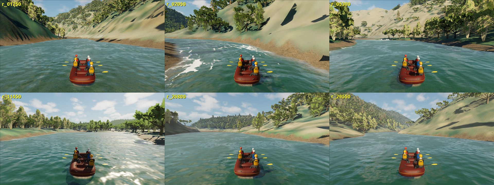

# South Fork discharge-consistent riverbed

September 26, 2026. **Inferred hydraulic geometry revision for the normal
FullReach map.** Evidence used: the captured (hydro-flattened) 3DEP water
surface and water outline already in the repository, the authored 1,600 cfs
(45.3 m3/s) discharge and the solver's Manning roughness (0.035). The bed below
the water surface remains inferred; nothing here is measured bathymetry.

## What the player saw

A capture pass at the rapids that the NAIP imagery and the captured water
surface both identify (Meat Grinder 1.25 km, 2.05 km, 5.3 km, 11.45 km, the gorge
at 26.8 and 29.55 km) showed smooth water everywhere except Troublemaker:

## Cause

The submerged bed of every inferred water vertex was the captured surface
lowered by `min(2.2 m, 0.35 x shore distance)`. Riffles and rapids were
therefore as deep as pools, and the bed had no hydraulic controls:

- The captured surface has real pool-riffle structure: Meat Grinder drops 4 m in
  150 m (slope 0.027), the 2 km rapid 3 m in 150 m, Troublemaker 2.1 m in 60 m;
  pools are nearly flat (0.001-0.004).
- On the uniform trough the river drains below its captured outline. The full
  cook still discharged about twice its inflow after 17,700 s; the 4,950 s frame
  the game uses has a median absolute surface error of 0.46 m (10th/90th
  percentile -1.06/+0.69 m) and subcritical flow through most rapids.
- A local Meat Grinder test (17 tiles, water started at the captured surface)
  settled 1.11 m below the captured surface on the previous bed.

## Method

`physics/scripts/build_south_fork_discharge_bed.py` (numpy only) rebuilds the
submerged vertices of the 2 m context grid; dry vertices, the captured surface
and the water outline are bit-identical.

| Quantity | Source | Status |
| --- | --- | --- |
| Water surface, slope, outline | captured 3DEP DEM (hydro-flattened) + breaklines | measured |
| Discharge 45.3 m3/s | authored 1,600 cfs scenario | authored; flight-time flow unknown |
| Roughness n = 0.035 | existing solver configuration | authored |
| Cross-section shape f = min(1, d / L), L = max(3 m, 0.3 x half-width) | assumption | inferred |
| Riffle depth: Manning strip normal depth per 5 m station bin | Q, n, captured slope, shape | inferred |
| Pool depth 2.2 m where captured slope < 0.006 (full at < 0.002) | previous prior | inferred |
| Mapped-water cells > 0.3 m above the local stage are bank | captured surface | inferred classification |
| Calibration: settled-cook surface bias | section cooks | fitted |

Pools are stage-controlled by the next riffle, so their depth does not set the
water surface; the riffle depths do. Six overlapping 6 km section cooks
(600 s each) showed that where a reach already passes the full discharge the
solver needs about 30% more riffle depth than the strip estimate (median error
+0.19 m on 690 settled riffle bins; settled pools +0.01 m). The calibrated bed
adds the measured settled bias where available and 0.30 x the riffle depth
elsewhere. The registered Troublemaker domain (owners 2, 3, 5, 6) is untouched;
depth blends to the previous prior within 30 m of its rectangle.

Resampling the 2 m grid with the render/collision triangle rule reproduces all
761,600 checked 1 m hydraulic bed cells of the previous geometry bit for bit,
so the cook, the runtime packets and the terrain meshes carry one surface.

## Result: full-river cook

RESULTS_PLACEHOLDER

## Limits

- The bed shape, pool depths and the 30% calibration are inferred. The river
  bottom under the water is not measured anywhere outside Troublemaker.
- The discharge that produced the captured water surface is unknown; the bed is
  the one that makes 1,600 cfs flow at the captured surface.
- Rapids now have their captured drops and supercritical chutes, but no
  boulders: standing waves and holes from individual rocks are not modelled.
- Troublemaker keeps its registered geometry and its previous stage error.
- A 2005 SMUD/PG&E channel-morphology report (screened by the other session)
  contains surveyed transects at four sites; once registered they can test
  these inferred depths.
