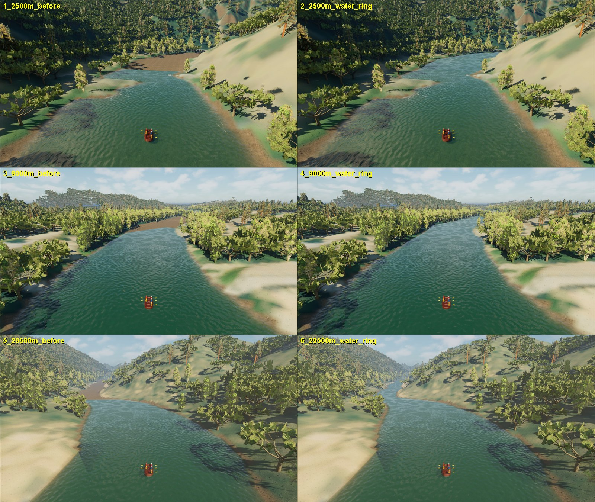
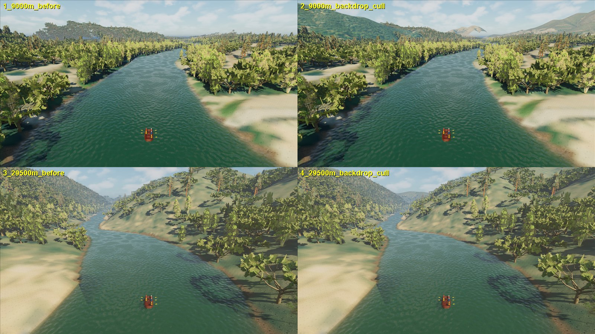
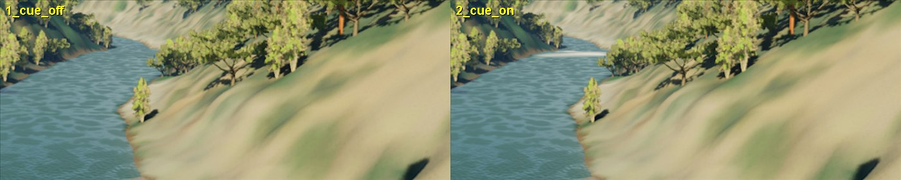

# South Fork far-field view: water ring, streamed canopy and terrain backdrop

September 26, 2026. **Playable delivery in the normal FullReach map.** Three
defects made every long view end abruptly: the river stopped in a straight
line about 110 m ahead over dry bed, distant trees floated in the sky, and the
terrain itself ended about 2 km out. All three are fixed with render-only
changes. No hydraulics, collision, cooked water, bed or terrain tile changed.
Evidence: [receipt](south-fork-far-field-view/receipt.json).

## 1. Water beyond the live window

The live carrier is a raft-centred 224 m square, and the authored band water is
hidden in play (so the solver owns all visible water). Nothing drew the river
beyond the carrier, and the carrier itself never draws its outer ~20 m of
station rows (edge coverage below 0.6). Elevated and downstream views showed the
water ending in a straight line over a dry channel, including from the normal
chase camera at 26.5 km.

A new render-only ring (`RaftSimWaterSurfaceFarField.cpp`) draws the cooked
state the carrier already falls back to outside the solver crop: the verified
shared Cartesian atlas (bed, depth and velocity of the discharge-bed cook). It
uses the carrier's material instance, vertex encoding (depth, speed, wet mask,
flow UVs) and texture origin on a global 4 m lattice out to 640 m, clipped at
the bank by the same shoreline builder. A far vertex is dropped only where every
carrier vertex within one far cell is drawable, so the ring meets the carrier
exactly where the carrier stops drawing; overlapping cells sit 3 cm lower.
The ring has no collision and never feeds support, buoyancy, D3 or D4. It is
cooked water, not live water: no foam is invented there, and it only rebuilds
when the carrier recentres or its drawable mask changes.

`RaftSim.P4.SouthForkFullReachSupportParity` now also asserts that the ring
is drawn (it was: builds 1, 5,211 triangles).

## 2. Trees floating past the loaded terrain

A game-world trace audit under every canopy instance (`RaftSim.CanopyGroundAudit`)
found every tree with ground under it within -23 to +10 cm of that ground, but
809 trees 2.07-2.36 km from the camera at 29.5 km had no ground at all. Their
256 m canopy cells load when the cell touches the 2 km World Partition range,
so their far trees outlive the terrain streamed out under them. Canopy actors
in streamed worlds now cull instances beyond 1,950 m at BeginPlay
(`raftsim.StreamedCanopyCullDistanceM`; no asset resave). After the change:
0 drawn trees without ground at 9 km and 29.5 km (22,134 and 34,246 traced).

## 3. The world ending at 2 km

The map has no far-field terrain at all: only its 441 detailed tiles, streamed
within 2 km. (The older far-field generator's patches and dressing are gone
from the current map.) Two always-loaded, non-colliding, non-shadow-casting
Nanite backdrops now fill the view:

- **Inner, 8 m** (`build_south_fork_terrain_backdrop.py`): from the same 2 m
  context grid and discharge bed the tiles use. Each vertex takes the lowest
  source vertex of the cells it touches minus 1.5 m, so it is provably below
  every tile surface (checked at all 5.31 M source vertices: minimum clearance
  1.50 m, median 4.7 m, p99 12.0 m). It shows only where no tile is loaded.
- **Outer, 16 m** (`build_south_fork_terrain_backdrop_outer.py`): measured USGS
  3DEP DEM windows already in the repository (the eight full-reach window
  exports), reprojected from Web Mercator to the scene's UTM frame. Against the
  context grid's dry captured surface (60,047 vertices) it differs by median
  -0.05 m, 10th/90th percentile -0.62/+0.47 m, so the registration is right.
  Inside the context grid only a one-cell edge band is drawn, kept below it.

Provenance and rights: the outer backdrop's source files are the hash-locked
full-reach window exports, USGS 3DEP, U.S. public domain, credited in
`CREDITS.md`. Their source policy forbids promoting the raw files to game
geometry on their own; here they are reprojected, checked against the
captured context grid, lowered by a margin, kept non-colliding and used only as
distant presentation, never as river, bank or collision geometry.

Both use the tiles' draped ground material. Installing them saved only their
mesh assets and two external actor packages
(`unreal/Scripts/install_south_fork_terrain_backdrop.py`); the map file keeps
the hash pinned by the verified runtime bundle.

At 9 km the "floating forest" on the left horizon was the last loaded canopy
cells against sky; it is now a hill, with the Coloma-area ridges behind it.

## Performance

Editor-hosted game, 1,200 frames, rows 30-1169, 20 FPS goal (50 ms p95, no
frame over 100 ms). The host was shared with another session's jobs (31-70%
background CPU before runs), and the game thread sets the frame time in every
run, so run-to-run spread (25-38 ms mean) exceeds any effect measured here.

| run | mean ms | p95 ms | max ms | > 100 ms |
| --- | ---: | ---: | ---: | ---: |
| menu, ring on (two runs) | 28.8 / 25.6 | 39.3 / 35.0 | 59.3 / 41.3 | 0 |
| menu, ring off | 36.5 | 46.3 | 72.9 | 0 |
| station 11.5 km, ring on | 34.9 | 42.8 | 60.9 | 0 |
| menu, ring + cull + backdrops (three runs) | 38.5 / 35.1 / 35.9 | 47.6 / 42.4 / 42.4 | 69.7 / 50.0 / 59.2 | 0 |
| station 9 km, ring + cull + backdrops | 35.9 | 46.1 | 56.6 | 0 |

All pass. GPU time rose by about 1-3 ms with the backdrops (10.4-12.8 to
12.4-13.7 ms mean) and is not the bottleneck. A ring rebuild costs 11-16 ms on
one frame; it happened twice in 1,200 frames of normal drifting, and 291 times
in the P4 telemetry tests, which teleport the raft between stations.

## Limits and next steps

- The ring is the cooked field. Distant rapids get only an inferred
  whitewater cue: fast, near-critical cooked water (the carrier generator's
  Froude onset 0.78, plus a speed gate standing in for the surface-roughness
  gate a 4 m lattice cannot resolve) whitens the ring. On the v2 cook it marks
  3-12% of rapid reaches and at most 1% of flats and pools, and reads as a pale
  band across the river ahead (`raftsim.FarFieldWaterFoam`). It does not break,
  move or carry foam, and is appearance, not measured aeration.

- A faint straight line remains visible under magnification where the carrier's
  north-south edge meets the ring; changing the ring's drop (0.5-12 cm) or
  flattening carrier normals does not change it, so it lies in the carrier's
  edge row. A straight-edged dark wedge on the water at 29.5 km predated the
  ring; it was an inferred-bed ledge and is removed by
  [bed v2](south-fork-bed-v2.md).
- Distant hills beyond 1.95 km have no trees, and the backdrops lower ridges
  (inner: median 4.7 m) until tiles stream in. The outer backdrop ends where
  the repository's 3DEP windows end; there is still no terrain beyond them.
- HLODs for terrain and canopy would replace the cull and backdrops with the
  engine's own streaming proxies; not built here.
