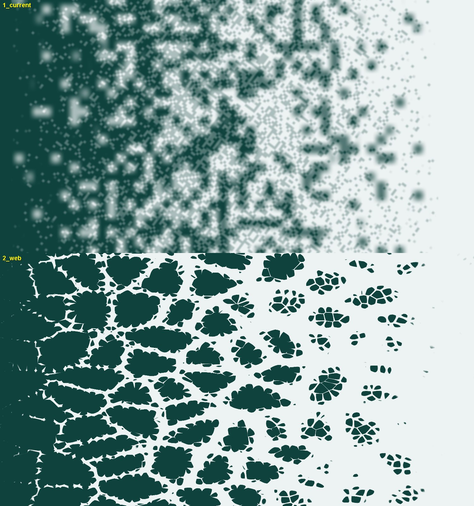
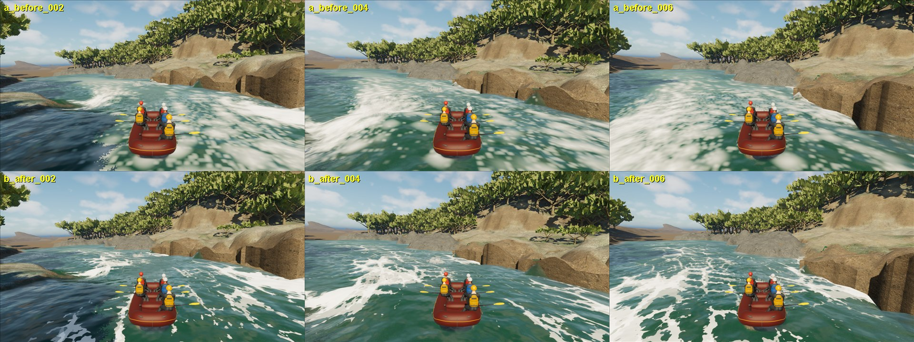
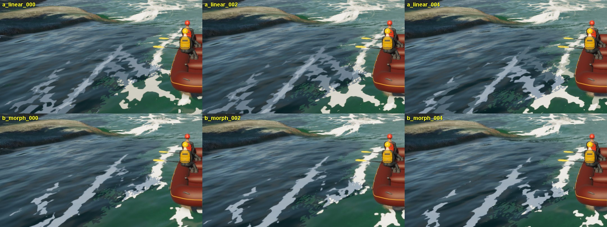

# South Fork foam: flow-stretched web replaces the lattice "polka dots"

September 26, 2026. **Playable delivery in the normal FullReach water**, not
visual acceptance of breaking water. Foam amount, transport, density,
geometry, contact and the material's other layers are unchanged.

## Cause

Normal play rendered transported foam as evenly spaced white blotches with
rounded square corners across the whole river. The optical coverage node of
`M_RaftSim_SouthForkRaftTransmissionWaterV4` inlines
`unreal/Plugins/RaftSim/Shaders/Private/RaftSimFrothCells.ush`, which
thresholded one random value per 0.59 m grid cell (plus a 9 cm grid) and
blended the corners. That preserves expected coverage but draws a regular
lattice of rounded squares; its two-phase flow-map crossfade also smeared the
blotches into the blurred look seen in chase captures.

## Replacement

`physics/scripts/build_froth_web_shader.py` generates the include. It keeps the
contract (presentation only, expected coverage equals the transported fraction
`p = 1 - exp(-amount * density)`, same interface, same two-phase backtrace and
committed clock) and replaces the pattern with:

- a coarse Voronoi foam web (F2 − F1, 2.4 m cells) whose distance metric is
  stretched 2× along the local current, so filaments trail downstream;
- a fine torn-lace web (0.55 m cells, 1.2× stretch);
- an isotropic two-octave clumping field (3.2 m and 1.3 m) for patches and gaps;
- a 9 cm grain that roughens edges near the camera.

Each component passes through its measured quantile table (33 knots) and the
mix is re-ranked, so the combined value is uniform and `P(V < p) = p`. Three
mixes (full, without grain, coarse only) are blended by pixel footprint, so
expected coverage stays `p` at every distance before the far fade to `p`.
Only the metric is stretched; the lattice is fixed in world space, so curving
current cannot swirl or shear the pattern. World metres are wrapped at
4,118.4 m, an integer multiple of every lattice scale, for float precision
without seams.

Checks recorded in `south-fork-foam-web/froth_web_receipt.json`:

- The stretched F2 − F1 distribution only rescales with stretch (ratio
  2/(1+S) within 1% at every quantile), so it is normalised by (1+S)/2. Without
  that, slack water would have been biased by −16% coverage.
- Independent verification draws: worst |coverage − p| over p = 0.05…0.95 is
  0.28% (slack), 0.22% (half stretch) and 0.58% (full stretch) across all three
  mixes; the generator refuses to write above 1%.
- Neighbour searches (5×5 coarse, 3×3 fine) were checked exact against 9×9/7×7
  searches over 300,000 samples.

## Delivered to normal play

`RaftSim.RefreshSouthForkCurrentNormals` re-inlined the include and saved the
normal water parent (the only saved asset change). The rebuilt editor game at
station 8,300 m, same cameras as before:

Foam now reads as torn white filaments and patches with open water between
them, trailing with the current, instead of a dotted lattice.

Performance, normal Boot → menu → South Fork launch, 1,200 post-travel CSV
frames each, rows 30–1169, Editor-hosted game at 1280×720 offscreen:

| run | mean ms | p95 ms | max ms | frames > 100 ms |
| --- | ---: | ---: | ---: | ---: |
| `south-fork-foam-rock-20260926` | 24.2 | 32.6 | 47.5 | 0 |
| `south-fork-foam-rock-20260926b` | 29.3 | 41.2 | 69.2 | 0 |

Both pass the current 20 FPS goal (50 ms p95, no frame over 100 ms). The run-to-
run spread is larger than any plausible shader cost, and both include the rock
envelope, so no causal cost claim is made either way. The main profiler needs
PowerShell 7 (`ProcessStartInfo.ArgumentList`) and the Python CSV audit, neither
installed on this host; `unreal/Scripts/profile_south_fork_menu_launch_ps5.ps1`
reproduces its normal-menu launch arguments and ordered log receipt in Windows
PowerShell 5.1 and reads the CSV using the footer header (Unreal appends
columns as stats first appear, so early rows are narrower). Receipt:
`unreal/Saved/RaftSimValidation/south-fork-foam-rock-20260926b-frame-audit.json`.

## Phase morph (follow-up, same day)

The inherited two-phase flow map crossfaded two coverages whose patterns are
displaced by half a second of current (0.5 x speed). With sharp foam up to half
of all foam pixels sat at half opacity (pale ghost copies; the old lattice
smeared the same way). The generator now morphs the phases in rank space:
`s = w*Va + (1-w)*Vb`, mapped back to uniform by blending its independent-
uniform (trapezoid) CDF with the identity using a displacement-indexed
factor calibrated per mix (21 knots at 0.1 m, speed-to-stretch coupling
included). Off-knot verification over weights 0.1-0.9, p 0.05-0.95 and
displacements 0.05-1.7 m: worst coverage error 1.75% (gate 2.5%; the static
mixes stay within 0.6%). Receipt: `south-fork-foam-web/froth_web_receipt_v2.json`.

Foam now reads as crisp streaks that evolve between frames rather than
doubled pale copies. Normal Boot/menu run with the morph: mean 24.5 ms,
p95 33.0 ms, max 49.3 ms, no frame over 100 ms (not a matched A/B).

## Remaining foam defects

- Foam edges are flat-shaded and decal-like at close range; bubble-scale
  brightness/normal variation is still missing.
- Breaking crests and hole faces are unchanged: this is the transported-foam
  optical pattern only.
