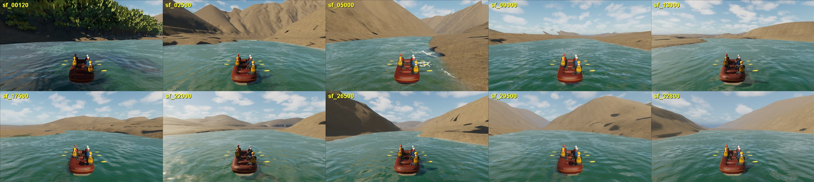
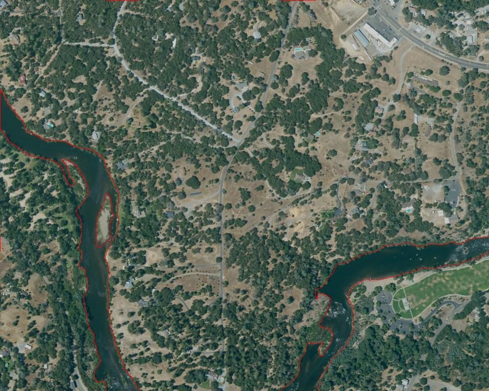
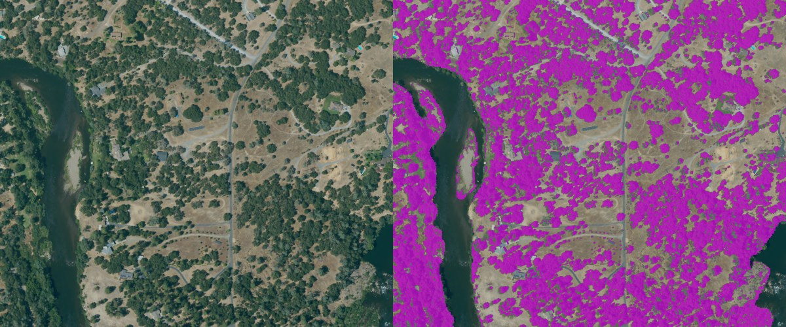
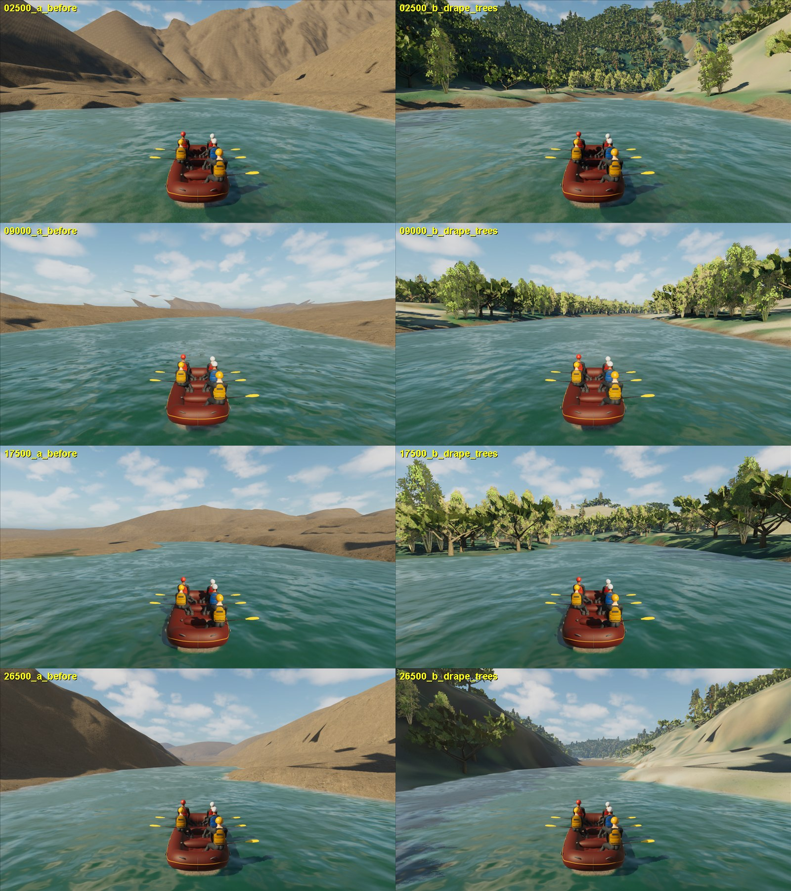

# South Fork full reach: NAIP ground colour and canopy from imagery

September 26, 2026. **Playable delivery in the normal FullReach map.** Evidence
used: the official NAIP (USDA/APFO, July 2022) window exports and 3DEP-derived
terrain grids already in the repository. Species, heights, crown forms and
trunk positions are inferred. Not geographic, photoreal or release acceptance.

## What the player saw

A ten-station survey of the normal map (120 m to 32.8 km) showed that outside
Troublemaker and the Chili Bar put-in the whole run rendered as bare tan hills
with no vegetation:

Causes, from the saved assets: `M_SouthForkCompositeGround` (used by all 441
terrain tiles) samples registered NAIP only inside the 680 m Troublemaker
window and otherwise returns one procedural rock/sand albedo; the only canopy
actors were the 1,268 LiDAR/NAIP trees at Troublemaker and the Chili Bar
captured canopy. The repository's own NAIP of the corridor shows mostly dense
interior live oak / pine woodland with golden grass openings around Coloma.

## Ground colour: full-reach NAIP drape

`physics/scripts/build_south_fork_naip_drape.py` (Blender, numpy) reprojects the
eight `production_corridor/full_reach_windows/*/source/naip.png` exports into the
terrain frame (UTM 10N, the 2 m context grid extent) as one 16384 x 8192 RGBA
texture at 1.221 m per pixel, with edge-feathered blending across overlapping
windows. Alpha is 0 on the terrain's inferred submerged bed
(`unknown_submerged_bed_mask.tif`: 0 dry, 1 submerged, 255 outside corridor).

Registration defect found and corrected: the windows were requested as
non-square EPSG:3857 boxes with a square 4096 x 4096 size and without
`adjustAspectRatio=false`, so the image service returned square extents about
each box centre. Using the requested boxes stretched one axis up to 2x (the
river and the terrain's water mask disagreed by 30-50 m and windows ghosted).
With the square extents the imaged river and the terrain's water outline
coincide; an automated check (blue-minus-red and darkness index versus the
submerged mask, +/-6 steps of 4.9 m) peaks within one step of zero
(correlation 0.258 against 0.256 at zero offset):

`unreal/Scripts/install_south_fork_naip_drape.py` imports the texture
(`T_SouthForkFullReachNAIP`) and extends the registered-colour custom node:
outside the Troublemaker window the drape replaces the procedural albedo where
its alpha is valid. `tune_south_fork_naip_drape.py` (V2) uses full weight, keeps
the rock material only on faces steeper than about 66 degrees, and lets the
scanned rock detail modulate the photo around 1. The Troublemaker branch and
all geometry, collision and water are unchanged. Orthophoto colour includes
capture lighting and canopy tops; it is appearance evidence, not albedo.

## Canopy: trees where the imagery shows canopy

`physics/scripts/build_south_fork_naip_canopy.py` classifies canopy on the drape
(sRGB luma < 0.33 and G >= R, off the submerged bed) and keeps a tree on a
jittered 6.5 m lattice where at least half of a 3 m disc is canopy, the slope
is at most 40 degrees, the point is at least 2 m from the submerged bed, and it
is not within 6 m of an existing captured tree or inside the Troublemaker
domain. Roots use the captured surface grid (bilinear).

Result: 140,683 trees in the corridor: interior live oak crown family V3
(111,555), riparian white alder within 25 m of the water (10,759) and pine
(18,369; the ponderosa meshes stand in for gray/ponderosa pine). Species mix,
heights (per-form ranges scaled by local canopy density) and yaw are inferred.

`unreal/Scripts/integrate_south_fork_naip_canopy.py` places them as 659
spatially loaded `RaftSimCapturedCanopyActor`s in 256 m cells (oak actor and
riparian/pine actor per cell), non-colliding, settings mirrored from an
existing canopy actor, roots sunk 20 cm. Existing actors are unchanged.
`verify_south_fork_naip_canopy_roots.py` traces a deterministic 3,000-root
sample against the loaded physical ground: 0 misses; stored root minus ground
p1 -4.9 cm, median -0.01 cm, p99 +5.3 cm (one outlier +2.2 m).

Archived: `physics/data/real_world/south_fork_american_chili_bar/reconstruction_2026_09/full_reach/naip_canopy_20260926/`
(placement SHA256 `bda1ea1ff90e30d21c3c2eadbe888213eeaf8428c5e37fb170885098fce3852b`)
and the drape/install/tune receipts beside it.

## Result in the normal game

Same review-station cameras before and after:

The run now reads as a wooded foothill river: forested slopes near Chili Bar,
tree-lined banks through Coloma, wooded gorge walls. Floating far-field shards
on the 9 km horizon (pre-existing) are hidden behind the new banks, not fixed.

Performance (1,200 CSV frames each, rows 30-1169, Editor-hosted game, 1280x720):

| launch | mean ms | p95 ms | max ms | frames > 100 ms |
| --- | ---: | ---: | ---: | ---: |
| normal Boot/menu (starts 120 m) | 26.6 | 36.7 | 54.2 | 0 |
| review station 2,500 m (densest forest) | 25.0 | 34.1 | 53.4 | 0 |

Both pass the 20 FPS goal (50 ms p95, no frame over 100 ms).

## Limits and next steps

- Trees are placed from 2022 canopy colour at ~1-2 m imagery resolution: no
  LiDAR canopy heights outside the four local LAZ tiles, no species survey.
- Some grass/bare slopes read pale in raking light; this is the imagery.
- Crown meshes are the project's stylised families; understory shrubs, rocks
  on banks and riparian gravel bars are still missing.
- Far hills beyond the drape coverage keep the procedural albedo; the
  far-field shards seen at 9 km remain a separate defect.
- Trees beyond the World Partition loading range rely on HLODs, which were not
  rebuilt here; distant tree pop-in has not been reviewed in motion.
