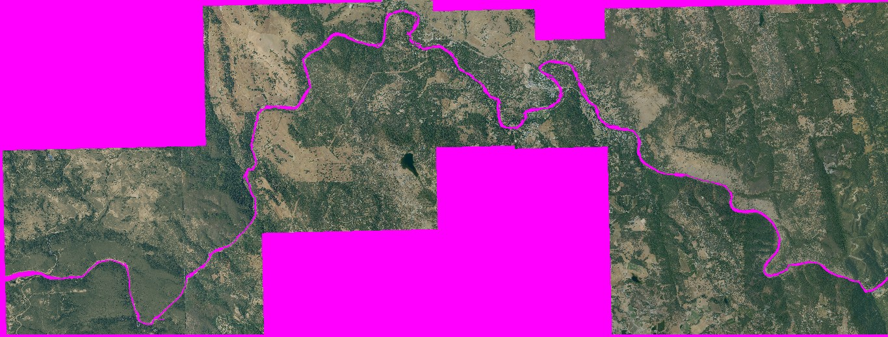
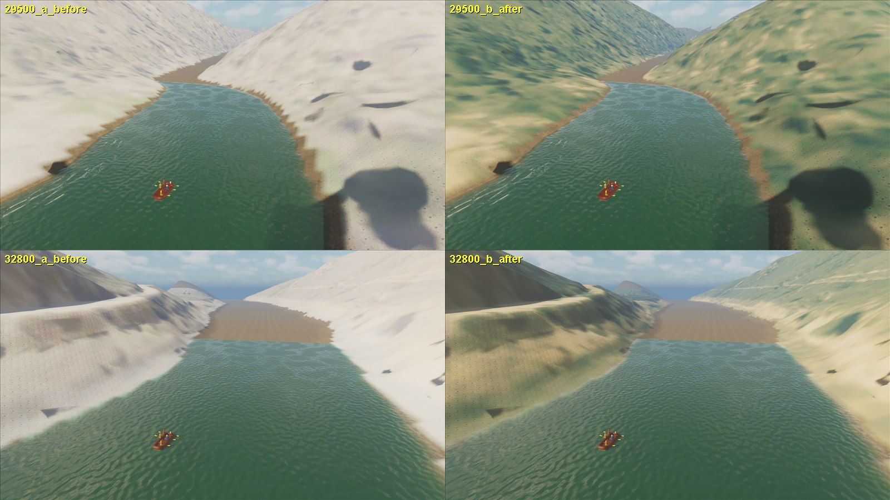
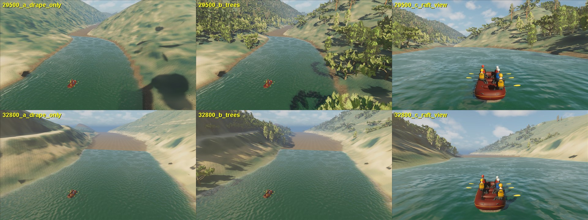

# South Fork NAIP drape v2: lower gorge colour and full water mask

September 26, 2026. Follow-up to [drape and canopy](south-fork-naip-drape-canopy.md).
Playable texture update only; material, geometry, collision, water and canopy
actors are unchanged by this step.

## Defects found in the first drape

- **Near-white lower gorge.** An elevated ten-station survey showed the current
  route's last ~7 km (26.5-33.2 km) as almost white slopes. The window names use
  the retired 49 km route's stationing: the current lower gorge is covered only
  by `salmon_falls_takeout_approach_41500_49077m`, and that export contains a
  washed-out, desaturated source tile inside the image service mosaic (60% of
  the window; mean saturation 0.05 against 0.22 in the rest of the same image).
- **Water mask on the old grid.** The drape excluded the submerged bed using the
  composite mask (9,871 columns) although the terrain's context grid extends to
  10,006 columns, so the extended ends had no water exclusion. The other
  session found the same defect in the canopy placement and is repairing it.

## Changes in `physics/scripts/build_south_fork_naip_drape.py`

- The water mask is `source_context_extension/unknown_submerged_bed_mask.tif`
  on the context grid, so every terrain tile uses its own submerged-bed mask.
- The two windows named for stations beyond the retired route only fill pixels
  no other window covers (colour-matched by the median of the overlap; gains
  were 1.00/1.01/1.00). They are nevertheless the only imagery for the current
  lower gorge.
- `recolor_washed_tile`: the washed tile is detected from 64 px blocks with mean
  saturation < 0.08, refined per pixel within one block using locally smoothed
  saturation, and recoloured by luma-quantile transfer from the same window's
  normal pixels (a pixel at luma quantile q takes the median colour of normal
  pixels at quantile q). This keeps the tile's spatial structure (crowns,
  grass, roads) and assigns colours from the same acquisition's normal area.
  It is a colour correction, not new evidence.

Registration against the terrain water mask still peaks within one 4.9 m step
of zero (0.233 at zero, 0.234 best).

`unreal/Scripts/update_south_fork_naip_drape_texture.py` re-imports the PNG over
`T_SouthForkFullReachNAIP` (receipts in `south-fork-naip-drape-v2/`).

## Lower-gorge canopy (same day, after the channel repair)

With the recoloured drape the corrected placement builder (context water mask,
from the other session's repair) finds 164,046 trees. The candidate lattice and
jitter are unchanged, so additions are the positions absent from the installed
placement: 24,211 trees, 99% of them in the lower gorge west end. They are
installed as 203 separate actors labelled "South Fork lower-gorge NAIP canopy"
(existing actors untouched). Root sample: 0 misses, p1..p99 -3.9..+3.3 cm.
848 installed positions no longer pass the corrected filters (266 are the
water-cell trees already removed); the others were left in place, not removed.
Archive: `naip_canopy_20260926/lower_gorge_additions_placement.json`.

Frame cost on an otherwise idle host (the September 26 channel-repair run that
failed at p95 74.3 ms overlapped this session's Blender/capture jobs):

| launch | mean ms | p95 ms | max ms | frames > 100 ms |
| --- | ---: | ---: | ---: | ---: |
| normal Boot/menu, idle host | 26.2 | 35.2 | 54.8 | 0 |
| review station 30,500 m with lower-gorge trees | 24.2 | 37.2 | 58.5 | 0 |

## Still open

- A dark notch at the left waterline at 29.5 km and the flat reservoir-like
  water surface ahead at 32.8 km need separate inspection.
