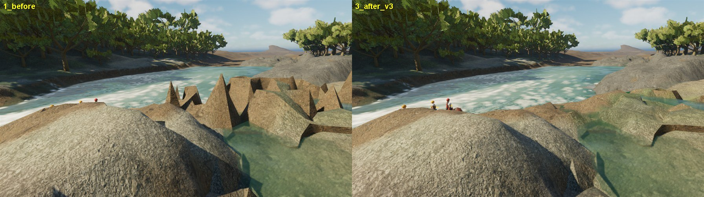
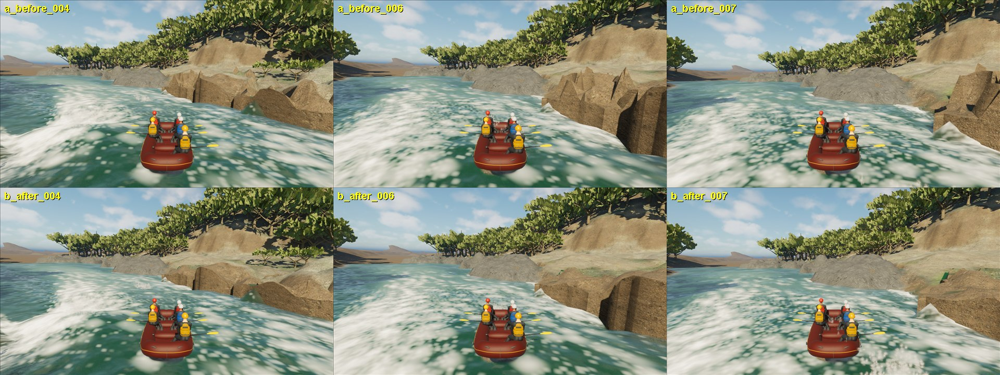

# Troublemaker captured rock: interpreted envelope installed in normal play

September 26, 2026. **Playable delivery in the normal FullReach map**, not
geographic or visual acceptance of the rapid. South Fork remains first and
unfinished.

## What the player saw

Normal-play captures at station 8,300 m (review station launch, rebuilt editor
game) showed the bank rock on the left of the rapid as a field of 1.5–2.5 m
triangular pyramids with flat vertical walls. Layer isolation with the new
`RaftSim.HideTaggedActors mesh=<asset>` option attributes the spikes, and the
large grey boulder beside them, to one asset:
`SM_CapturedRockInferredFlanks` (actor `StaticMeshActor_UAID_04421A89ABE5930203_1558143815`).
Hiding `SM_SourceMatchedGround` or `SM_SouthForkTroublemakerJoin` leaves every
spike in place. `RaftSim.ListActorsNear <radiusM> [delayS]` was added to list
the visible primitives, assets, materials and tags around the raft.

That asset is the installed September 15–17 solid: the roof triangulates 1,601
individual 2019 LiDAR returns (0.5 m bins, 1 m maximum edge, 1,534 class 1
"unclassified"), closed by 496 inferred vertical wall triangles to an internal
floor. 114.8 of its 462.5 m² roof were steeper than 60°. The 1 m hydraulic bed
cooked from the same solid tracks the roof within 5 cm at the median but sits
up to 2.5 m **below** the spikes (95th percentile of roof minus bed), so the
rendered/collision spikes already disagreed with the physics.

## Interpretation (inference, not measurement)

`physics/scripts/build_troublemaker_rock_envelope.py` derives a lower-only
envelope: the grey-scale morphological opening of the roof TIN by a paraboloid
of radius 1.0 m (0.1 m raster). LiDAR cannot see through rock, so rock lies at
or below every return; the opening is the highest surface at or below the
returns whose convex curvature radius is at least 1 m. The radius was fixed
before looking at results at the capture's own resolution limit (the 1 m
maximum triangle edge): narrower convex features are not resolved by this
sampling and cannot be told apart from single-return vegetation or noise. No
return is relabelled, deleted or moved in the source archives.

Constraints tying it to the installed hydraulics (cooked arrays unchanged):

- A vertex in a 1 m cell that is dry in every one of the 11 retained frames of
  the installed 4,900–5,400 s cook may only drop while staying at least 0.3 m
  above the highest cooked water surface within 1.5 m (any frame). The minimum
  achieved is exactly 0.30 m, so no dry rock newly meets the rendered water.
- A vertex in a cell the solver keeps wet may drop, but never below that cell's
  hydraulic bed. The solver already has water flowing there; a sub-cell spike
  standing above it was the inconsistency.
- Topology, XY, the internal floor and the wall footprint are identical; wall
  tops follow their boundary roof vertices.

| roof metric | installed | envelope |
| --- | ---: | ---: |
| area steeper than 45° (m²) | 198.3 | 74.5 |
| area steeper than 60° (m²) | 114.8 | 13.5 |
| area steeper than 75° (m²) | 36.6 | 0.65 |
| vertices changed | – | 970 of 1,601 |
| lowering median / 90th / max (m) | – | 0.07 / 0.57 / 2.30 |

An earlier variant froze every vertex with water within 1.5 m (1,095 of 1,601)
and removed little; a second froze wet-cell vertices and left the tallest
spikes standing in partly wet cells. Both are retained in `tmp/` and superseded.

## Installation and verification

- Export: `unreal/Scripts/export_troublemaker_rock_envelope.py` (Blender, same
  frame, winding and 45° authored crease normals as the installed solid).
- Install: `unreal/Scripts/install_troublemaker_rock_envelope.py` imports
  `/Game/RaftSim/Environment/SouthForkReconstruction/Troublemaker/RockEnvelope20260926/SM_CapturedRockEnvelope`
  with the original settings (imported normals, complex-as-simple collision
  from the render triangles, CPU access, Nanite full fallback, same
  `MI_SouthForkCompositeGround` material), then points the one rock actor at
  it and saves only that external actor package. The previous mesh asset and
  material are byte-unchanged; reverting is a one-actor change.
- Imported bounds match the export within 0.1 cm; 6,404 triangles.
- Archived data and receipts:
  `physics/data/real_world/south_fork_american_chili_bar/reconstruction_2026_09/full_reach/rock_envelope_20260926/`
  (envelope NPZ SHA256 `36811cf7adf7710fefaaba3ffbb6dfc11d4dc113a44b7daf322a4090c0a4c1a3`).

Engine evidence (same station, same cameras):

The side view loses the spike field entirely; the rock now reads as low,
rounded bedrock with the pools the solver already had. From the river, the
roof spikes are gone but the **flat inferred vertical walls remain**: they meet
the water, so reshaping them changes the wetted footprint and needs a matching
bed/flow update. That is the next geometry item for this rock.

Gates: `RaftSim.M6` 3/3 pass with the envelope. `RaftSim.P4` fails 8 of 9 both
with and without the envelope (identical results on the committed baseline);
its assertions encode the retired architecture (authored Troublemaker boulder
contacts, a 26,065-vertex carrier budget against the current Cartesian
50,625, 0.5 m presentation spacing, the retired `L_Troublemaker` telemetry).
They are an existing regression-maintenance item, not caused by this change.

Not established: surveyed rock shape, underwater geometry, rendered-wall
realism, full-route geometry, or visual acceptance against dated references.
