# South Fork American full-reach inspection — 2026-09-02

Scope requested: inspect the crew paddling animation from multiple angles
and verify the characters render and animate correctly; inspect the South
Fork river environment every few metres and verify that water and rocks
render and animate correctly and that the boat physics behaves; report
findings.

Method: headless `-game` runs of `L_SouthForkAmerican_FullReach` at
1920x1080 with the review commands added for this pass
(`RaftSim.CaptureRaftSeries`, `RaftSim.SurveyReach`,
`RaftSim.ManoeuvreCheck`; see docs/water-visual-feature-plan.md, "Review
tooling"). Every claim below is backed by a screenshot under
`unreal/Saved/Screenshots/` (`stroke_*`, `survey_*`, `manoeuvre_*`) or a
parseable log line (`RaftSim survey station:`, `RaftSim manoeuvre:`).

## 1. Crew paddling animation

Captured with a raft-attached camera at 0.25 s cadence while the crew
executed AllForward (2.0–2.6 m/s) and AllBackward, from four angles:
bow-on (`stroke_bow_*`), beam (`stroke_side_*`), guide-seat rear
(`stroke_rear_*`), and three-quarter front-high (`stroke_quarter_*`).

### Rendering — pass

- Every seat renders a complete CC0 body: skin-toned head with eyes and
  brows under the helmet, identity-specific skin, helmet brim over the
  brow with the chin straps falling beside the face (not across it),
  wetsuit, PFD reaching the collarbones, boots on the floor (rear view).
- The three defects fixed earlier today stay fixed under motion: no
  neoprene spike over the face, no black yoke or flap above the vest, no
  collapsed heads. Shadows of crew and paddles land on the tubes and
  water consistently.
- Paddle blades read as moulded amber plastic with a spine highlight from
  every angle, including edge-on from the guide seat.
- The guide avatar does NOT appear in any external capture: with the
  player pawn seated in first person the guide body is hidden for the
  eye-socket camera (`RaftSimGuidePawn.cpp` first-person sync), so the
  stern looks empty from a chase or shore camera. By design for play, but
  any third-person or replay camera will show a guideless raft.

### Animation — pass with notes

- AllForward runs at 1.25 cycles/s. Across the bursts the full cycle is
  visible: catch ahead of the hip, submerged power phase (blade tips
  visible below the surface in the beam view), exit behind the hip, and
  an airborne forward recovery. Seats carry phase offsets, so the crew
  reads as a coordinated but human-staggered rhythm rather than a
  metronome.
- Hands stay on the T-grip and shaft through the cycle; no shaft/tube or
  shaft/body interpenetration in any sampled frame. Elbows now bend
  naturally with the arms hanging from the rig's own shoulders (the
  24 cm elbow-drop bound never engages visibly).
- AllBackward mirrors the cycle cleanly (`stroke_back_*`).
- Raft speed under AllForward at the put-in: 2.0–2.6 m/s on 0.8–1.2 m/s
  water, i.e. ~1.4 m/s of paddling contribution for four paddlers —
  plausible.
- Notes: (a) blades enter and leave the water with no splash, drip or
  wake — there is no paddle-entry VFX in the project (no
  `PaddleSplash`/`BladeSplash` emitter exists), so strokes look dry;
  (b) heads hold a fixed forward gaze through the stroke (no head/neck
  motion), which reads slightly mannequin-like at close range; (c) about
  a quarter of screenshot requests at 0.25 s cadence are dropped by the
  engine, a review-tooling limitation only.

Figures: `stroke_bow_000/003.png`, `stroke_side_003.png`,
`stroke_rear_*`, `stroke_quarter_*`, `stroke_back_*` and the contact
sheets `sheet_stroke_*.png`; reduced copies below.

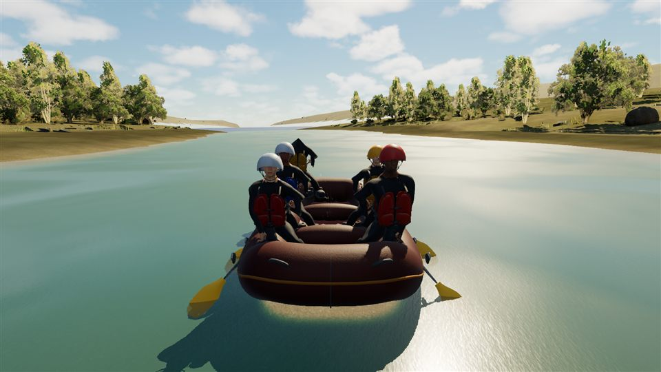
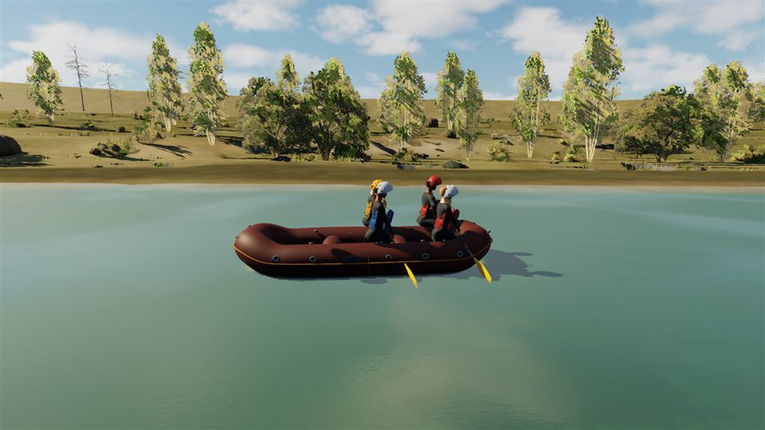
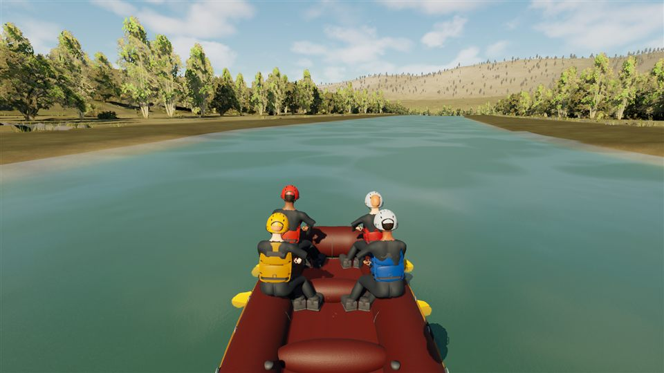
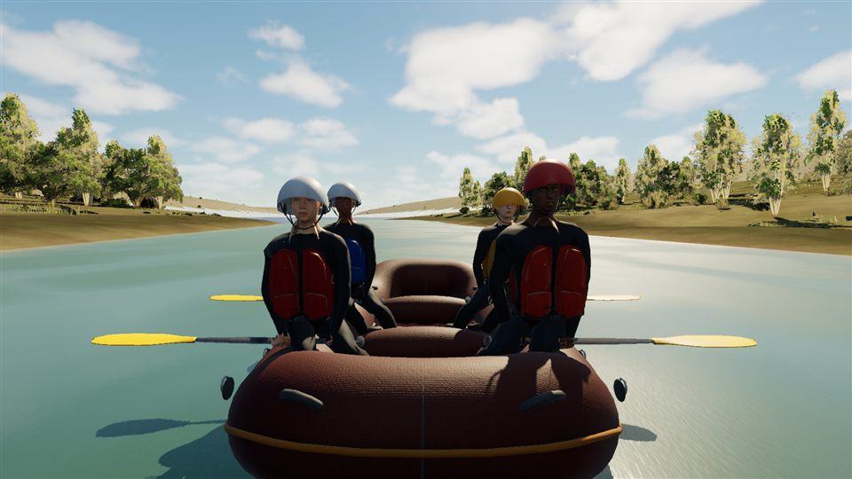

## 2. Reach survey (water, rocks, boat support)

`RaftSim.SurveyReach` walked the raft down the bound corridor
(0–49 078 m) in sub-80 m hops, settling 3–4 s at every 100 m station,
photographing each stop from a chase camera (twice, 0.4 s apart) and a
shore camera, and logging raft support, water and rock telemetry plus a
5 m water sweep over ±50 m at the centreline and ±6 m — i.e. the water
field was probed every 5 m along the whole reach, three abreast. Contact
sheets of every station (`sheet_survey*_chase_*.png`,
`sheet_survey*_side_*.png`) were reviewed, and every flagged station was
opened at full resolution.

Coverage: 489 of the 491 stations between 0 and 49 000 m (6900 and 9200 m
were skipped by the walk-in logic; their neighbours are covered), 10 259
water samples at 5 m spacing, 1 467 station photographs. The survey had
to be run four times because it kept exposing bugs in the thing it was
measuring: run 1 (0–6 800 m) stalled on a corridor projection fold at
7 600 m, runs 2–3 (6 900–11 800 m) were ejected off-corridor by the same
inverse-projection fault, and run 4 (9 200–49 000 m, on the fixed build)
completed with zero recoveries, zero capsizes and 9 minor flags.

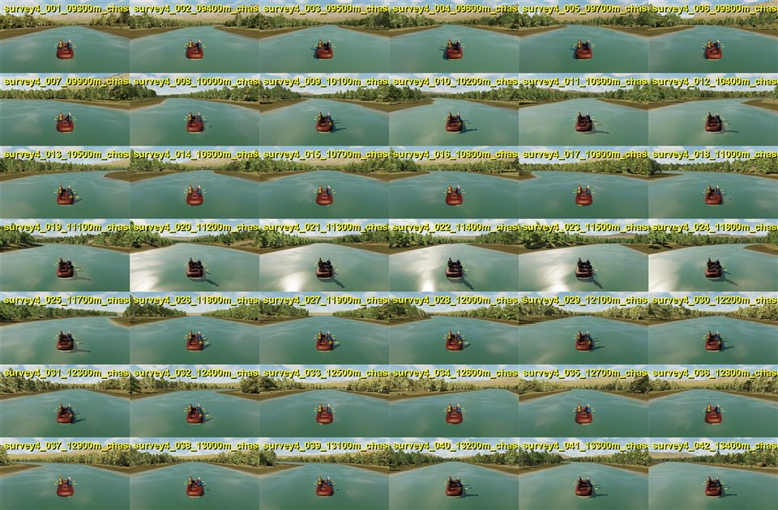

### Water — what is right

- Continuous, wet, flowing water from the put-in (~120 m) to the take-out
  at every station the corridor map could place the raft on (see the
  corridor fault below for the exceptions): depth 0.9–3.1 m, 0.65–5.6 m/s,
  no stagnant samples, no implausible velocities.
- Pools read as glassy green-teal with sky reflection; riffles and rapids
  carry whitewater texture, foam and spray sprites (2000–2500 m,
  3200–3400 m, 8300–8500 m); rocks in the channel wear foam collars and
  wakes.
- The rendered surface animates with the flow: in chase-frame pairs
  0.4 s apart the mean per-pixel change in the water band scales with
  water speed (7.2 and 7.5 on 5 m/s reaches at 500 and 4000 m against
  2.5–4.5 in the sky band; 1–2 on 0.7 m/s pools), i.e. ripples advect on
  fast water and pools are near-still, as expected. Spray sprites and
  foam move in the rapids bursts.
- Bridge at 5200 m: piers, truss and its shadow all land correctly on the
  water and the far bank (`bridge-5200.jpg`).

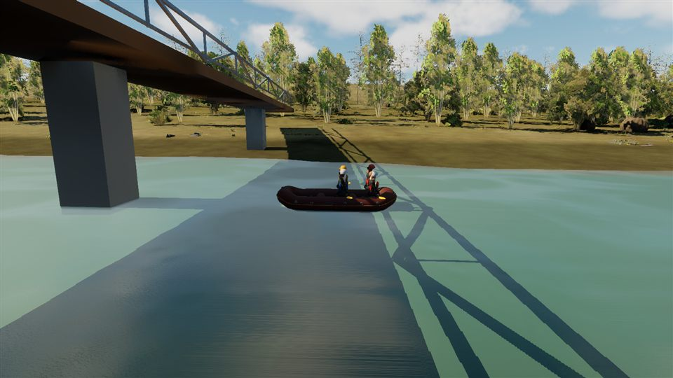
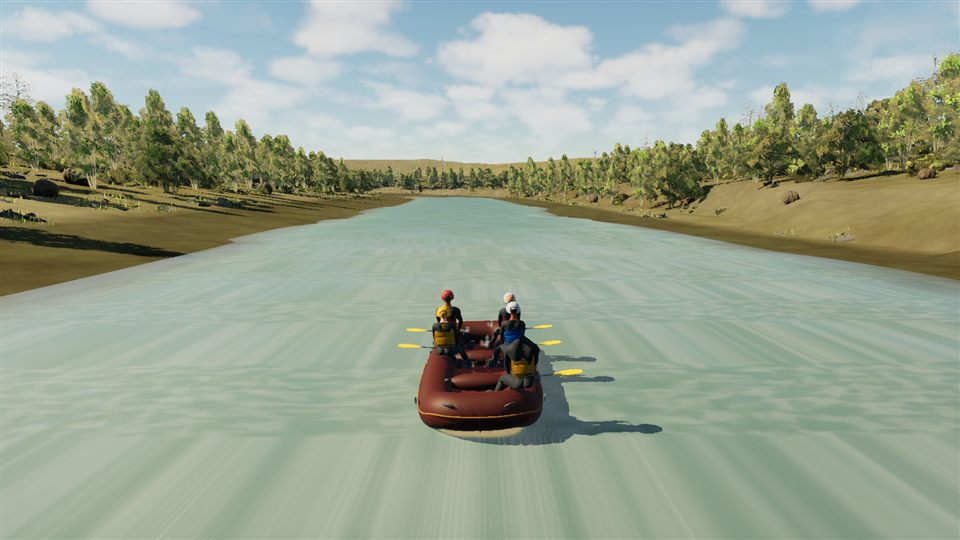
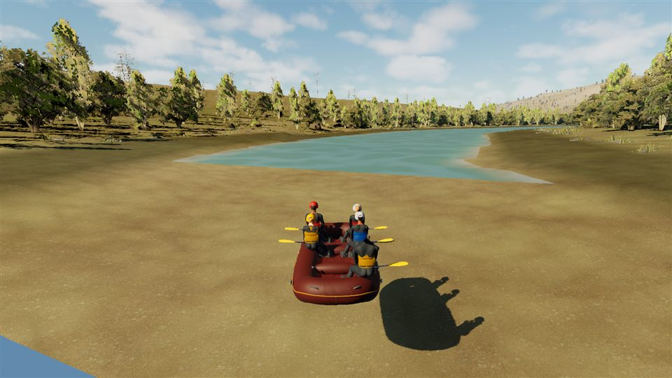

### Water — defects

1. **Raft apparently swallowed by the surface in rapids — withdrawn.**
   Run 1 frames at 2100, 2400 and 3300 m showed only the crew's upper
   bodies above a translucent whitewater sheet
   (`rapid-2400-swallowed.jpg`, `rapid-2400-side.jpg`) while physics
   freeboard read 9–25 cm. Re-checked on the corrected survey tooling
   with water-layer isolation (all layers vs. live overlay hidden vs.
   static tiles hidden; `rapids-layer-isolation.jpg`): at both 2100 and
   2400 m the hull now floats visibly above the sheet in every variant
   (freeboard 16–25 cm, roll ±1°). The run-1 frames caught the raft
   still surfacing from the survey's own teleport drop (it carried the
   upstream Z into a 1.2 m/5 m drop), not a rendering fault. No layer
   sits above the hull at rest.

   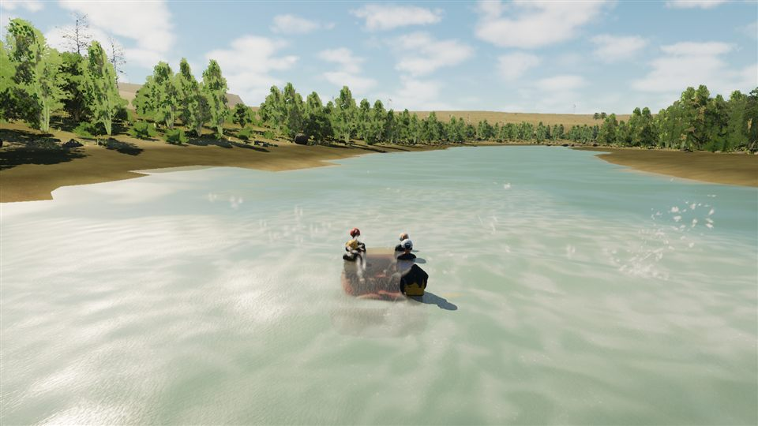
   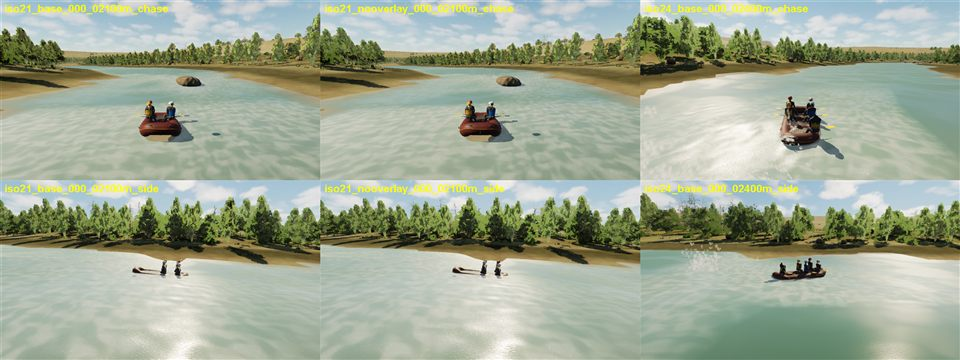
2. **"Plaid" bars on fast flat reaches** (4000–4300 m, 4900–5100 m,
   8300–8500 m; `survey_041_04100m_chase.png`, `survey3_015_08400m_chase.png`).
   At grazing angles the water shows two crossing families of straight
   bright bars, a lattice with ~10 m and ~30 m periods. That is the
   analytic station-periodic wave term in the water material
   (`sin(0.19·s + 0.61·l)` family, see the "bright bars" note at
   RaftSimWaterSurfaceActor.cpp ~1391); the carrier's presentation
   standing-wave scale is already 0 in single-surface mode, so this comes
   from the material's own traveling-wave WPO. Cosmetic but obvious from
   the guide seat on every fast straight.
3. **Corridor station 0–100 m is dry**: the corridor starts upstream of
   the put-in beside the reservoir plane; the solver reports 1.9 m of water
   there but nothing is rendered (`survey_000_00000m_chase/side.png`).
   Not reachable in play (the raft spawns at ~120 m) — authoring nit.
4. **Corridor centreline crosses gravel bars on the inside of bends**
   (800, 1900, 2900, 4800, 6700–6800, 7000, 8200, 9600, 10700, 11800 m:
   2–9 of 21 centreline samples dry while both ±6 m samples stay wet).
   The water is fine; the authored centreline is what leaves the wet
   channel. Only matters for tools that assume "lateral 0 is wet".

### Corridor map fault (physics-affecting, fixed in this pass)

The inverse river projection `WorldToRiverCoordinates` was ambiguous:
its cost is "how well does this segment's ruled corridor reconstruct the
point", and a straight segment's lateral line reconstructs *any* point
of the plane exactly, so a segment hundreds of metres away tied with the
true one and won on candidate order. Survey evidence: the raft placed
exactly on the 9300 m centreline (forward map correct to 7 m against the
JSON) resolved to station 9694 / lateral −553 m; the same happened at
10 300–10 600 and 11 400–11 700 m, and around 7550–7760 m hops flipped
between 7553 and 7641 with the moving water window cold-rebooting on
every hop (54 reboots in one minute). Because every world-space water
probe goes through this inverse, the field read **dry** at those points,
the static sheet's live-level clip retired the rendered river (brown
riverbed, `survey3_024_09300m_chase.png`), and the raft fell through the
channel into the void (`survey3_025_09400m_chase.png`, roll −53°,
50 m/s). A player drifting through those reaches would have lost water
support the same way.

Fix: reconstructions with |lateral| > 256 m (the authored corridor
half-width) are rejected inside the candidate cost
(RaftSimWaterRuntimeAdapter.cpp). Regression: the M4 coordinate-map test
now sweeps the entire corridor every 50 m at lateral 0/±30 m and requires
forward→inverse agreement (station ≤ 4.1 m, lateral ≤ 0.5 m); it passes
on the fixed build. Field check: a 25 m re-walk of 9200–9700 m on the
fixed build found 2.2–2.4 m of flowing water at every station, and the
full 9 200–49 000 m survey (398 stations) then ran with zero
off-corridor recoveries, where runs 2–3 had lost the raft at
9.3–9.5, 10.3–10.6 and 11.4–11.7 km.

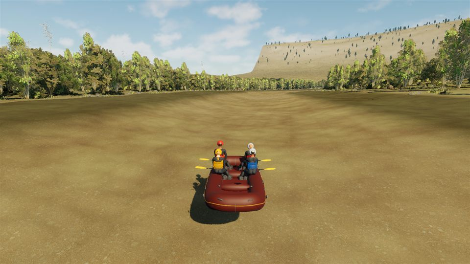
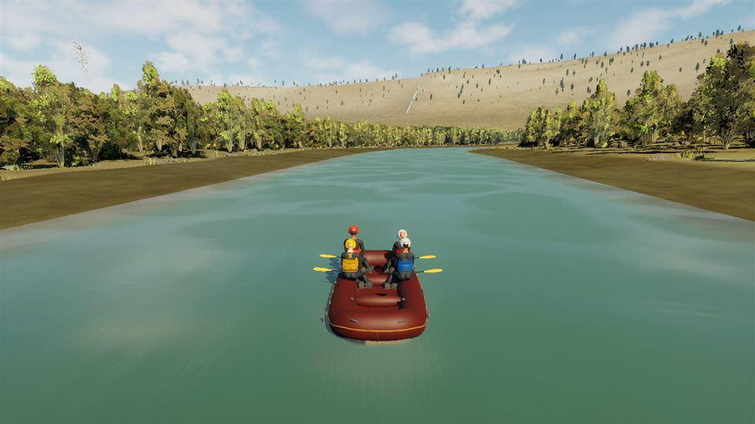

### Rocks

- Dressing boulders (HISM `Boulder01–06`, `ScenicBankRock01–06`) are
  present along banks and in the channel from 900 m on; every one checked
  at full resolution sits on the bed or bank at a plausible waterline with
  a wet band, and mid-channel rocks (2100, 4900–5100, 8300–8500 m) carry
  foam collars and wakes. No floating or hovering rocks were seen.
- No authoritative `ARaftSimRockObstacleActor` (the D4 contact rocks that
  can wrap a raft) lies within 40 m of any surveyed station: on this reach
  every rock the raft can meet is a dressing instance with query/physics
  collision, not a wrap-capable obstacle. Worth knowing before tuning
  wrap/pin behaviour on South Fork.
- Rocks are static (no animation expected); the animated elements around
  them — pillow foam, wakes, spray sprites — are present where flow is
  fast enough.

### Reach table (one row per kilometre; raft at rest at each station)

Columns: km, stations, wet stations, water speed range (m/s), depth
range (m), freeboard range (cm), steepest centreline drop within any 5 m
(m), dressing-rock instances within 40 m of a station, flags.

| km | n | wet | water m/s | depth m | freeboard cm | max drop | rocks | flags |
| --- | --- | --- | --- | --- | --- | --- | --- | --- |
| 0 | 10 | 10 | 0.7-5.1 | 1.6-2.9 | 16-19 | 0.37 | 4 | 800: centreline on bar |
| 1 | 10 | 10 | 1.3-4.0 | 0.9-2.9 | 16-21 | 0.71 | 6 | 1000: 0.7 m tilt across a bar; 1900: centreline on bar |
| 2 | 10 | 10 | 1.2-3.9 | 1.2-2.7 | 8-18 | 1.20 | 15 | 2100/2400: rapids (drops 1.05 and 1.20 m per 5 m); 2900: bar |
| 3 | 10 | 10 | 0.7-5.3 | 1.5-3.1 | 16-25 | 1.09 | 6 | 3200/3300: rapid |
| 4 | 10 | 10 | 2.0-5.6 | 1.8-3.0 | 5-20 | 0.43 | 8 | 4800: bar; 4900: freeboard 5 cm |
| 5 | 10 | 10 | 1.0-3.0 | 1.1-2.7 | 15-18 | 0.34 | 8 | bridge at 5200 |
| 6 | 9 | 9 | 1.1-3.0 | 2.4-2.7 | 16-18 | 0.13 | 0 | 6700/6800: bar |
| 7 | 10 | 10 | 0.6-3.5 | 1.8-2.9 | 16-18 | 0.25 | 2 | 7000: bar; corridor fold 7550-7760 (fixed) |
| 8 | 10 | 10 | 0.8-2.9 | 0.7-3.0 | 15-21 | 0.35 | 12 | 8200: bar |
| 9 | 9 | 9 | 0.7-2.9 | 2.3-2.7 | 16-17 | 0.13 | 2 | inverse fault 9300-9500 (fixed) |
| 10 | 10 | 10 | 0.6-2.6 | 2.3-2.6 | 16-18 | 0.13 | 0 | inverse fault 10300-10600 (fixed) |
| 11 | 10 | 10 | 0.6-0.6 | 2.4 | 16-17 | 0.03 | 1 | inverse fault 11400-11700 (fixed) |
| 12-13 | 20 | 20 | 0.6-0.8 | 2.4 | 16-17 | 0.03 | 2 | pool |
| 14 | 10 | 10 | 0.8-5.5 | 1.8-3.2 | 16-20 | 0.37 | 2 | fast reach 14300-14500 (streaks) |
| 15-24 | 100 | 100 | 0.7-2.8 | 2.2-2.6 | 16-18 | 0.15 | 8 | — |
| 25 | 10 | 10 | 0.4-1.9 | 0.7-2.9 | 16-18 | 0.10 | 7 | 25600/25900: bar |
| 26 | 10 | 10 | 0.6-1.6 | 1.3-2.7 | 16-17 | 0.20 | 0 | 26700: bar |
| 27 | 10 | 10 | 0.1-2.2 | 1.8-2.6 | 16-17 | 0.19 | 11 | 27800: bar (11 of 21 samples) |
| 28 | 10 | 10 | 0.6-1.8 | 1.0-3.1 | 16-19 | 0.15 | 3 | 28500: bar |
| 29 | 10 | 10 | 0.5-1.4 | 1.1-2.6 | 16-18 | 0.79 | 18 | 29100: bar; 29200: one slack sample beside a rock |
| 30 | 10 | 10 | 0.5-1.4 | 1.5-2.6 | 16-17 | 0.16 | 3 | 30100/30900: bar |
| 31-38 | 80 | 80 | 0.4-1.8 | 1.7-3.6 | 16-17 | 0.17 | 10 | — |
| 39-48 | 100 | 100 | 0.2-3.0 | 3.5-5.2 | 16-17 | 0.15 | 0 | slow, deepening reach to the take-out |
| 49 | 1 | 1 | 1.0 | 5.1 | 16 | 0.06 | 0 | corridor end |

"bar" = the authored corridor centreline runs over a gravel bar (dry
centreline samples while both bank-side samples stay wet); the water
itself is intact. Full per-station data: `survey_all.csv` (scratch) or
the `RaftSim survey station:` lines in the survey logs.

## 3. Boat physics manoeuvre check

`RaftSim.ManoeuvreCheck` at the put-in (water 0.7–1.05 m/s), logging
speed, along-flow speed, heading and yaw rate once a second
(`manoeuvre.log`):

| phase | command | result |
| --- | --- | --- |
| 0–2 s | Rest | drifts at 0.93 m/s on 0.86–0.93 m/s water: tracks the current, zero yaw |
| 2–14 s | AllForward | 2.0–2.7 m/s within one second, oscillating with the 1.25 Hz stroke cadence; +1.5 m/s over the water |
| 14–20 s | Stop | 2.6 → 1.0 → 0.55 → 0.03 m/s in four seconds: the brace holds the raft against a 0.76 m/s current, then it creeps off at 0.3–0.5 m/s |
| 20–30 s | AllBackward | 0.1–0.8 m/s downstream against 0.8–1.05 m/s water, i.e. about −0.5 m/s relative to the flow (back strokes are capped weaker than forward strokes, as designed) |
| 30–34 s | Rest | recovers to water speed (1.0 m/s) |
| 34–44 s | TurnLeft | −4.5 to −9.8 °/s, ~80° in 10 s, speed held at ~1 m/s |
| 44–58 s | TurnRight | +6 to +8 °/s, symmetric |

Verdict: pass. Accelerations, braking, reverse and turn rates are all in
the range expected of a four-paddler raft, the raft never yaws or crabs
while resting (the "drifts into the left bank" report did not reproduce
here or in the earlier 130 s hands-off drift, where cross-stream speed
stayed within ±0.02 m/s), and no command left the raft in an odd state.

Reach-wide support telemetry (489 stations, raft at rest after a 3–4 s
settle): freeboard 13–25 cm at every station except three fast riffles
(2400 m: 9 cm with the bow pitched 7° up in a 1.2 m/5 m drop; 2800 m:
8 cm; 4900 m: 5 cm), zero grounded support points anywhere, pitch and
roll within ±8°, raft pressure and fabric integrity 1.00 throughout,
raft speed at rest within 0.2 m/s of the local water speed.

### Capsize recovery was broken on this map (fixed)

While the survey was throwing the raft around, every capsize ended with
the hull 400 m in the sky at 40 m/s or 1.6 km off-corridor two seconds
after the `RaftSim capsize:` line. Cause: `EnterCapsize` clamped the
recorded capsize point to world Z ±2 m (a tank-at-origin assumption) and
`RequestReflip` re-righted the hull there — on this map that is 300 m
under the riverbed, so the re-flipped hull materialised inside terrain
and the physics ejected it. The clamp is now taken around the local
water surface and the re-flip rights the hull 40 cm above the surface at
the guide's position. `P2.RaftFlipsAndRecovers` and
`M5.RuntimeRescueLoop` still pass; the resumed survey (398 stations) and
the rapids paddle-through below recorded zero capsizes.

### Paddling through the 2000–2600 m rapids

Walked to 1950 m and held AllForward (`rapid_pt.log`): the raft ran the
drops at 1–2.8 m/s on 1–3 m/s water, freeboard 16–22 cm, pitch within
±2°, no capsize, no grounding for 100 s — then, with nobody steering, it
crabbed 19 m river-left across the outside of the next bend and beached
(speed 0, one grounded point, water still moving at 0.2–0.5 m/s beside
it). The same happened from the put-in (beached 100 m in, at the first
right-hand bend). That is the behaviour behind the "the boat drifts into
the left riverbank" report: sustained AllForward with a fixed heading
carries the raft to the outside bank of every bend, exactly as a real
crew paddling straight without a guide stroke would. A hands-off drift
(no paddling) followed the current for 130 s without touching a bank.

## 4. Defects and follow-ups

| # | severity | finding | status |
| --- | --- | --- | --- |
| 1 | critical | Inverse river projection ambiguous: water field read dry and the raft fell through the channel at 7.5–7.8, 9.3–9.5, 10.3–10.6, 11.4–11.7 km | fixed (lateral bound); M4 round-trip gate added; verified by the 9.2–49 km survey |
| 2 | critical | Capsize recovery re-rights the hull at world Z ±2 m; on this map the raft is launched into the sky after any capsize | fixed (surface-relative); P2/M5 gates pass |
| 3 | medium | "Plaid" bright-bar lattice on fast flat reaches (4.0–4.3, 4.9–5.1, 8.3–8.5, 14.3–14.5, 25.3, 27.2–28.1, 31.1 km) from the material's analytic traveling-wave term at grazing angles | open — needs a material-side fix (amplitude gate or removal of the station-periodic term on the V4 parent) |
| 4 | low | Paddle blades enter and leave the water without splash, drip or wake (no paddle-entry VFX exists) | open — feature request |
| 5 | low | Guide avatar hidden from all external cameras while the player pawn is in first person, so chase/replay views show an empty stern | open — decide whether third-person cameras should un-hide the guide body |
| 6 | low | Crew heads hold a fixed gaze through the stroke | open — cosmetic |
| 7 | nit | Corridor station 0–100 m is upstream of the put-in with no rendered water; corridor centreline crosses gravel bars at ~20 bends (tools assuming "lateral 0 is wet" will misread them) | open — authoring |
| 8 | info | AllForward with no steering beaches on the outside of the next bend (100 m from the put-in; 100 s below 1950 m) — physically expected, but it is what players experience as "drifts into the left bank" | open — consider a soft auto-line/guide correction or clearer steering prompts |
| 9 | withdrawn | Raft "swallowed" by the rendered surface in rapids | not a defect (survey teleport artefact; isolation captures clean) |

Review-tool fixes made along the way (survey convergence on world
distance, hop-cap on non-progress only, teleport height from water/tagged
terrain, recovery when off-corridor, far-terrain proxy exclusion) live in
`RaftSimSurveyCommand.cpp`; the far-terrain proxy above the valley is
collidable and untagged, which any future trace-based tooling must know.
